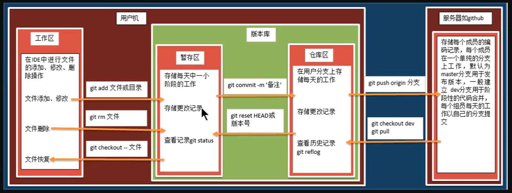

### Git

- Git 是目前世界上最先进的分布式版本控制系统

## 作用

- 源代码管理



用户机指的是本地/服务器指的是远程的

工作区可以进行任意的增删改查,不影响仓库/版本

git clone xxx

git init	初始化仓库

git config --global user.name "xxx"

git config --global user.email ""

git commit 可以直接编写提交说明 

git log 可以查看日志提交信息

git log --oneline 简写日志信息

.git文件是 git init创建的

.git是隐藏文件

使用 `git pull xxx`拉取项目的相关仓库

使用``git status` 查看是否提交git,和未提交的文件

使用`git add xxx` 的命令向本地git中提交 使用git add . 是提交工作区的所有修改到暂存区

使用`git commit -m '提示的名称'`提交文件	提交到暂存区

使用`git push`,在使用该命令后,需要向其中填入git的账号和密码,推送到远程似乎

使用git reset --hard commitid(xxx) 回退git版本,但是会丢失git的记录,可以使用git revert 版本号 替代

git branch 创建git分支,前提是已经使用git add 向本地git中提交过文件

git branch -M main 创建一个main分支,并将主分支切换为main

git branch -a 查看分支 -v 也可以

git checkout 分支名(查看分支后的) 切换分支
git checkout命令的一些常用参数包括：
-b: 这个参数意思是创建新分支并立即转至此分支。例如，git checkout -b new_feature会创建一个新的名为new_feature的分支，并且立即切换到此新分支。
-B: 这个参数可以创建或重置现有分支。如果分支存在，-B将重置分支为指定提交。如果它不存在，它将创建一个新分支。例如，git checkout -B existing_feature重置现有的'existing_feature`分支到最后一次提交的位置。
-f 或 --force：当你有未提交的更改时，默认情况下，Git 不允许你切换分支。用 -f 或 --force 参数可以强制切换，但未提交的更改将会丢失。
--track: 这个参数用于设置跟踪远程分支。例如，git checkout --track origin/feature会创建一个新的分支feature跟踪远程分支origin/feature。

git merge 分支名(合并分支)

如果在合并分支时出现异常,fail:fix conflicts and then ... 手动切换到文件,并将文件打开后手动修改为最新版的文件,在通过commit 再次手动提交,合并时都是需要在master分支下实现

git remote add origin xxx 添加一个远程仓库地址xxx

git remote add origin xxx 是 Git 命令，用于添加一个新的 origin 远程仓库。
在这个命令中：
git remote add 是用于添加一个新的远程仓库的命令。
origin 是你给这个远程仓库的简称（别名），origin 是默认名字，但实际上你可以使用任何你喜欢的名字。
xxx 是远程仓库的 URL，这样 Git 就知道在执行 push 或 pull 操作时，要向哪个地址发送或接收数据。

git push -u origin main
git push -u origin main 是 Git 命令，用于将你的本地 main 分支的最新更改推送到名为 origin 的远程仓库。
在这里：
git push 是 Git 的一个命令，用于将本地的提交推送到远程仓库。
-u 参数是 --set-upstream 的简写，它的作用是将远程仓库的指定分支设置为当前本地分支的上游（即默认的 "remote"）,以后只需要直接使用 git push 或 git pull 命令，不再需要指定远程仓库和分支。
origin 是远程仓库的名称。这是一个你前面用 git remote add 命令所设置的别名。当你克隆了一个远程仓库时，Git 会自动添加一个名为 origin 的远程仓库。
main 是你想要推送的本地分支的名称。
总的来说，git push -u origin main 命令的作用是将你的本地 main 分支上的提交推送到名为 origin 的远程仓库，并将其设置为默认的远程分支

git 是 Git 命令行工具。
remote 是用来管理远程仓库的一个命令。
-v 是 --verbose 的简写，用于打印更详细的信息。

来检查该本地仓库同步（连接）到了哪个远程仓库：

```
git remote -v
```

在git中使用`git log`命令后在终端中查看日志,但是在查看日志后无法使用esc退出,类似于vim的操作,需要按`shift+:`输入q退出	


> 基本步骤(如果不在idea中使用vsc工具):
>
> 首先创建一个新的文件夹,在新的文件夹中使用鼠标右键单机,选择git bash here
>
> 或者是直接移动到该文件夹,在文件夹下直接使用git init 命令初始化本地仓库
>
> 在初始化仓库之后,会发现本地文件夹中出现一个新的目录 .git文件夹(文件夹中的内容就是git仓库中的内容)
>
> 在未使用git add 提交到暂存区前,如果误删除了暂存区本地中的文件,则可以使用 git restore 文件名方式恢复文件在本地中

使用git revert 版本号 还原文件如果文件被删除了

> 如何查看git提交的远程仓库是哪一个?
> 在命令行中输入以下命令可以查看git提交的远程仓库信息：`git remote -v`
>
> 如何查看详细的远程仓库的地址?要查看详细的远程仓库地址，你可以使用 git remote show <remote-name> 命令。例如，如果你的远程仓库名称是 origin，你可以输入以下命令：
> `git remote show origin`


__如何查看文件夹是否已经链接到了远程的Git仓库?__

> 使用`git status`命令查看git 远程仓库的状态

如果这个目录是一个 Git 仓库，你应该会看到一些关于当前仓库状态的信息。如果不是，你会看到 "fatal: not a git repository" 这样的错误信息。
如果 'vscode-workspace' 是一个 Git 仓库，那么错误可能是由于以下原因：
远程仓库不存在。请检查你的远程仓库的 URL 是否正确。
你没有正确的访问权限。确保你有远程仓库的读/写权限。如果远程仓库在 GitHub, GitLab, Bitbucket 等平台上，你可能需要设置 SSH keys 或者获取正确的访问权限。
针对上述两种情况，你可以像这样查看/设置远程仓库的 URL：
查看当前的远程仓库配置：

```
git remote -v
```

设置/更换远程仓库的 URL：

```
git remote set-url origin your-remote-repository-url
将 your-remote-repository-url 替换为你的真实的远程仓库 URL。你可以在远程仓库的主页面找到这个 URL（通常在 "Clone" 或 "Clone or download" 按钮下）
```

删除一个已经设置的远程仓库，使用以下命令：

```
git remote remove origin
这个命令会删除名为 origin 的远程仓库设置。当origin已经被删除后，你可以按照正常的流程重新添加一个正确的远程仓库：
git remote add origin YOUR_NEW_REPOSITORY_URL
```

