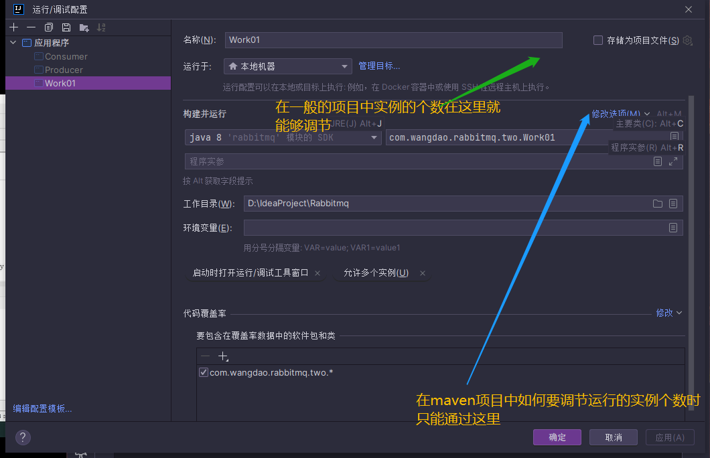

# ==IDEA常用快捷键==

- 删除当前行,快捷键 ctrl+y

- 补全代码 alt+/

- 添加注释和取消注释 ctrl+/

- 快速复制本行到下一行 ctrl+d

- 快速格式化代码 ctrl + alt  + L

- 自动导入补全类 alt + enter

- 插入常用方法(如set,构造器,get) alt + insert

- 快速跳轉到頁面的搜索 ctrl + shift + L

- 查看一个类的层级关系 ctrl+ H

- 在参数列表中使用ctrl + p查看参数是哪种数据类型,参数叫什么数据名称

- 自动分配变量名,通过在变量后面加 .var

- 将光标放在一个方法上,输出ctrl+B,可以快速定位到方法

- ### `Ctrl + Shift + U`：大小写转换

- ### `Ctrl + Left`：左移一个单词

- 使用 `Ctrl + Left + Shift`:快速左移单词

- ### `Ctrl + Right`：右移一个单词

- 使用 `Ctrl + Right + Shift`:快速右移单词

- ### `Home`：==移动至行首==

- ### `END`：==移动至行尾==

- ### `Ctrl + Shift + M`：移动至大括号

  多次按下快捷键，可以在左右两个大括号间切换。

- ### `Ctrl + [`：移动至代码块开始

  ### `Ctrl + ]`：移动至代码块末尾

- ### `Alt + Down`：下一个方法

  ### `Alt + Up`：上一个方法

- ### `Ctrl + PageUp`：移动至页面顶部

  ### `Ctrl + PageDown`：移动至页面底部

- 使用`Alt + left|right`: 控制左右移动文件,也就是文件左右切换 

- 使用`Ctrl + R`替换程序中的字符

- 使用`Alt + /`快速补全单词

- `Alt+Insert`快速创建一个文件,但是前提是将焦点移动到要创建文件的目录中


```text
alt + enter 快速导包，快速创建函数
CTRL + ALT + V 生成一个变量名
CTRL + shift/alt + enter 下/上一行
CTRL + ALT + m 快速抽取方法
alt + j 选中相同的代码
alt + / 提示单词
F2   定位错误，

#最重要的快捷键
    1. ctrl+shift+A:万能命令行
    2. shift两次:查看资源文件

#新建工程第一步操作
    1. module设置把空包分层去掉,compact empty middle package
    2. 设置当前的工程是utf-8,设置的Editor-->File Encodings-->全部改成utf-8,
#注释
    1. ctrl+/:单行注释

#光标操作
    1. ctrl+alt+enter:向上插入
    2. shift+enter:向下插入
    3. end:光标
#操作代码
    1. ctrl+d:复制粘贴一行
    2. ctrl+y:删除一行
    3. shift+F6:重命名
    5. ctrl+O:复写代码

#格式代码及其他功能
    1. ctrl+alt+L:格式代码
    2. 在代码中使用alt+insert:Generate,可以get/set等操作
    3. ctrl+alt+T:添加try/catch
    4. ctrl+alt+M:抽取代码
    5. ctrl+alt+F:变量抽取全局变量
        1. 还需要设置前缀:Editor-->code style-->java-->code Genertion-->设置Field的前缘为m添加
    6. ctrl+alt+v:方法体内值抽取成变量
    8. 保存成模板:ctrl+shift+L,这个是自定义的(save as live Template)
    9. 选中内容:tab进行退格
    10. shift+tab:反向退格
    11. alt+shift+上下键:选中代码移动
    12. ctrl+shift+上下键:可以移动当前方法体,如果移动一行代码只能在代码体内移动
    13. ctrl+shift+U:代码大小写
    15. ctrl+shift+enter:补全代码(一行尾添加分号,如果是if等添加括号)

#进入代码
    1. ctrl+鼠标:进入代码
    2. ctrl+B:进入代码 跳转到方法的声明和查看方法的使用出处
    5. ctrl+shift+12:最大化窗口
#替换查找
    1. ctrl+r:替换
    2. ctrl+F:查找
    3. ctrl+shift+F:全局查找
    4. ctrl+shift+R:全局替换
    5. ctrl+shift+i:快捷查看方法实现的内容
    6. ctrl+p:查看参数
    7. ctrl+Q:查看文档描述
    8. shift+F1:查看api文档
    8. ctrl+F12:查看类的方法
    9. ctrl+H:查看类的继承关系
    10. 查看变量的赋值情况:
        1. shift+ctrl+a:输入analyze data flow to Here
    11. ctrl+alt+H:查看方法在那里被调用了
    12. ctrl+{}:可以定位方法体的括号
    13. F3:查看选中的内容
    14. shift+F3:反向查看内容
    15. ctrl+alt+B:查询那些类实现了光标所在的接口
    16. ctrl+U:查看父类
    17. ctrl+E:最近编辑的文件列表
    18. ctrl+alt+home:查看布局与对应的类
    19. ctrl+alt+H:查看当前方法在那里进行调用
#运行编译
    1. ctrl+F9:构建
    2. shift+F10:运行

#工程目录操作
    1. 新建文件及工程:选中要创建目录使用alt+insert
    2. ctrl+shift+a:输入show in explorer-->打开相应目录
    3. ctrl+alt+s:打开软件设置
    4. ctrl+alt+shift+s:打开module设置
    5. alt+1:当前目录区
    6. alt+7:当前类的方法列表查看
    7. ctrl+tab:切换目录及视图
    8. alt+shift+c:查看工程最近更改的地方
    9. ctrl+J:livetemp模板查看
#代码快捷操作
    1. 没有操作完成操作可以先写todo进行,就可以在todo的窗口进行查看
    2. F11定义书签
    3. shift+F11:查看书签
    4. ctrl+J:快捷调出模板
    5. alt+点击断点:禁用断点
    6. 调试状态下按下:alt查看变量能审查表达式的值

#组合快捷键
    1. F2:定位错误
    2. alt+enter:修正错误

    3. alt+鼠标:进入列编辑模式
    4. ctrl+w:选中单词,也可以选中整个
    5. 或其他组合操作

#编辑的位置
    ctrl+alt+左右键:这个是定位到编辑的位置
```



使用ctrl+g 在代码编辑处中实现直接跳转指定行

使用alt+1切换到项目中,使用enter进入项目的代码编辑中

使用ctrl+shift+方向将代码的位置进行控制

使用ctrl+e 查看最近打开的文件或者插件

在项目文件列表中使用空格键能够打开文件的缩略图

在使用GitHub Copilot中,使用alt+[  || 使用alt+] 能够快速选择不同的文法
