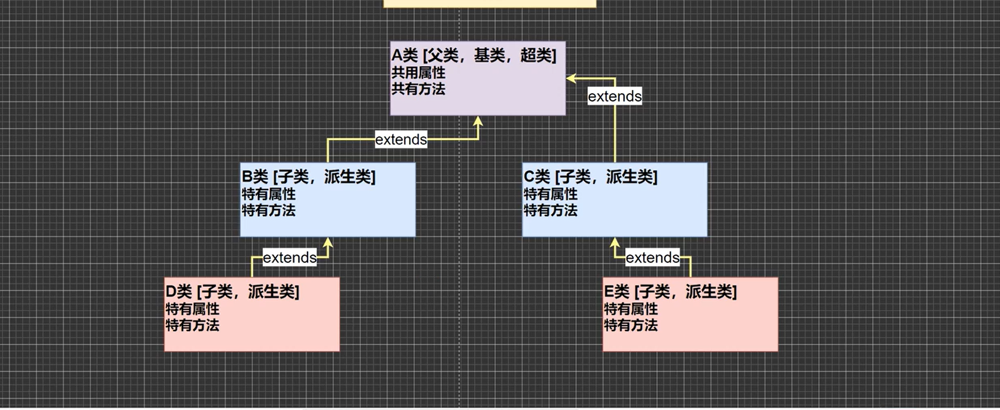
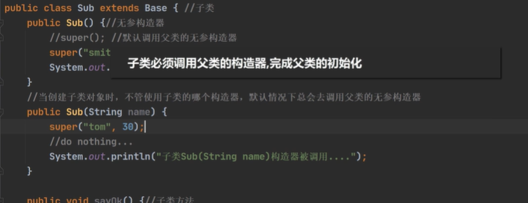

# 封装继承多态

### 封装(encapsulation):

> 封装就是将抽象出的数据[属性]和对数据的操作[方法]封装到一起,数据被保护在内部,程序的其他部分只有通过被授权的操作[方法],才能对数据进行操作


### 面向对象编程-封装的实现步骤:

1. 将属性进行私有化 [不能直接修改属性]

2. 提供一个公共的set方法,用于对属性的判断并赋值

   ```java
   public void setXxx(类型 参数名){//Xxx 表示某个属性
   	//加入数据验证的业务逻辑
       属性 = 参数名;
   
   }
   ```

   

3. 提供一个公共的get方法,用于获取属性的值(一般是对于私有的属性)

   ```java
   public 数据类型 getXxx(){//权限判断,Xxx某个属性
   	return xx;
   }
   ```


### 案例:

> 设计一个程序,不能随便查看人的年龄,工资等隐私,并对设置的年龄进行合理的验证,年龄合理就设置,否则就默认(Encapsulation01.java)
>
> 年龄,必须在1-120,年龄,工资不能直接查看,name的长度在2-6字符之间

注意:
将set方法在构造器中调用可以有效的避免,由于使用构造器造成的数据限制被绕过的问题


### 继承

增加代码的复用性,将相似的类中的相同部分提取出来,当多个类存在相同的属性(变量)和方法时,可以从这些类中抽象出父类,在父类中定义相同的这些方法和属性,所有的子类不需要在重复定义这些方法和属性,只需要使用extends来声明继承父类即可.



#### 继承的基本语法

> class 子类 extends 父类{
>
> }
>
> 子类就会自动拥有父类定义的属性和方法
> 父类又叫做超类,基类
> 子类有叫做派生类


### 继承的细节

1. 子类继承所有的属性和方法,但是私有属性不能再子类中直接访问(可间接),要通过公共的方法去访问(使用父类中创建的get方法),非私有的属性和方法可以直接访问
2. 子类必须调用父类的构造器,完成父类的初始化,(再一般的使用过程中,由于子类的无参构造器被调用,父类的无参构造器也被调用)默认情况下使用super()<==>调用父类的无参构造器
3. 当创建子类对象时,不管使用子类的哪个构造器,默认情况下总会去调用父类的无参构造器,如果父类没有提供无参构造器,则必须在子类的构造器中使用super()去指定使用父类的哪个构造器完成对于父类的初始化工作,否则编译不会通过

在创建父类中多个构造器,那么子类在自动调用时将不知道,调用哪个构造器,则需要使用super()手动选择需要调用的父类构造器,需要字super()的参数列表中填入对应的构造器参数

4. 如果希望指定的调用父类中的某个构造器,则需要显式的调用

5. super在使用时,需要放在构造器的第一行

6. super()和this()都只能放在构造器的第一行,因此这两个方法不能共存在一个构造器(这里的this指的是this()调用构造器)

7. Java所有类都是Object类的子类,Object是所有类的基类/超类/父类

8. 父类构造器的调用不限于直接父类!将一直往上回溯到Object类顶级父类,将中途经历的每一个class中都调用了super()方法

9. 子类最多只能继承一个父类(指直接继承),即Java中是单继承机制
   >当Java中的一个类已经继承了它的父类了,那么就无法继续继承一个除了该父类以外的类,但是如果需要可以使得他的父类继承于你所需求的类	形如A继承B,B继承C

10. 不能滥用继承,子类和父类之间必须满足 is-a 的逻辑关系

==注意==:在使用类的继承时,如果父类中已经由开发者自行定义了一个构造器|构造函数,那么子类构造器的默认使用super()方法时可能就没有父类的无参构造器可以调用,如果是自己定义了一个无参构造器则不影响

### 面向对象之抽象类定义

>在继承关系中,如果我们定义一个类,类中提供了一些公共的行为,但是并不需要创建这个类的实例,而是仅使用其子类的实例,我们把这种没有实例的类的称为抽象类(abstract class),抽象类中一般位于继承关系的上层,在抽象类中可以定义抽象操作

### 多态

>多态性是指同一个消息(操作)作用于不同的对象上有不同的解释,并产生不同的执行结果。例如：“画（draw）”，作用于“矩形”对象中，则绘制一个矩形在窗口内，反之，如果作用于“圆”对象中，则是在屏幕中绘制出一个圆