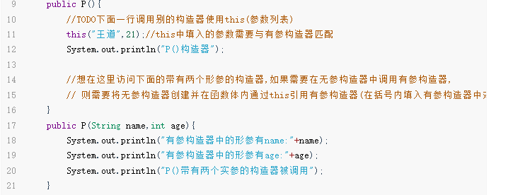

# 构造器中this的使用和不同构造器之间的调用

>```text
>this关键字可以用来访问本类的属性,方法,构造器
>this用于区分当前类的属性和局部变量
>访问成员方法的语法:this.方法名(参数列表);
>访问构造器语法:this(参数列表);注意只能在构造器中使用(在一个构造器中通过this调用另一个构造器)
>this不能在类的外部使用,只能在类定义的方法中使用
>```

```java
class P{
    //this只能在class中使用不能在main函数中使用,不能在类定义的外部使用
    /*
    细节:访问构造器语法:this(参数列表),不能在成员函数中使用
    注意只能在构造器使用(即只能在构造器中访问另一个构造器)
    注意:访问构造器语法:this(参数列表),必须放置在第一条语句
     */
    int age = 0;
    public P(){
        //TODO下面一行调用别的构造器使用this(参数列表)
        this("王道",21);//this中填入的参数需要与有参构造器匹配
        System.out.println("P()构造器");

        //想在这里访问下面的带有两个形参的构造器,如果需要在无参构造器中调用有参构造器,
        // 则需要将无参构造器创建并在函数体内通过this引用有参构造器(在括号内填入有参构造器中对应的参数),并且将this的语句放在无参构造器中的第一行
    }
    public P(String name,int age){
        System.out.println("有参构造器中的形参有name:"+name);
        System.out.println("有参构造器中的形参有age:"+age);
        System.out.println("P()带有两个实参的构造器被调用");
    }
    //细节:访问成员方法的语法:this.方法名(参数列表);
    public void f1(){
        System.out.println("age = "+age);//如果在f1()中创建了一个局部变量叫做age,不使用this的情况下会根据就近原则直接匹配到局部变量
        //如果使用了this则匹配到这个在类中对象的全局变量的属性,而不是匹配局部变量
        System.out.println("age = "+this.age);
        System.out.println("f1()  方法..");
    }
    public void f2(){
        System.out.println("f2()    方法..");
        //调用本类的方法f1
        //第一种方式
        f1();//直接调用同一个类中的不同方法
        //第二种方法是
        this.f1();//通过this对象访问方法,两种方法不相同,在继承上存在巨大差异
    }
}
```



==解释:==

>在无参构造器P()中,通过this(参数列表)调用有参构造器,可以使用有参构造器中的方法,或者是调用有参构造器进行对象的初始化赋值

注意:在自行创建构造器后,系统默认创建的无参构造器就失效,如果需要使用,则需要自定义无参构造器

在python中OOP教程中也有构造器
```python
def __init__(self,xx,yy,zz): # 其中xx,yy,zz均是要传入的形参,将在使用构造函数/构造器时传入
    self.name = xx
    self.age = yy
    self.salay = zz # 注意在python的构造器中没有使用类的属性的创建,由于语言的原因可以直接使用不需要创建属性
    
def fullname(self): #这里是创建了一个成员函数
    return '{},{}'.format(self.name,self.age)
```

