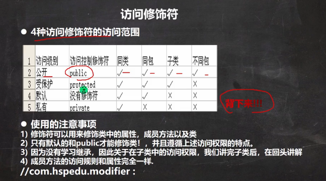

# 访问修饰符

### Java中提供四种访问控制修饰符号,控制方法和属性(成员变量)的访问权限(范围);

1. 公开级别:用public关键字修饰,对外公开
2. 受保护级别:使用protected 修饰,对一个子类和同一个包中的类公开
3. 默认级别:没有修饰符号,向同一个包的类公开
4. 私有级别:使用private修饰,只有类的本身可以访问,但是不对外公开

>- 在不同的包下,可以访问public 修饰的属性或者是方法
>  - 但是不能访问 protected,默认,private修饰的属性或者方法
>- 在同一个包中的同一个类下,四种属性都可以被访问,public,protected,默认,private的属性和方法
>- 在同一个包下不同类中,可以访问3种public,private,默认,但是不能访问private属性或者方法