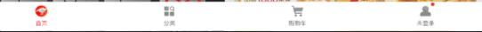
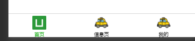

配置tabbar

> 如果一个应用是多tab应用,可以通过tabBar配置指定tab栏的表现,以及tab切换时显示的对应页

Tips

- 当设置 position 为 top 时，将不会显示 icon
- tabBar 中的 list 是一个数组，只能配置最少2个、最多5个 tab，tab 按数组的顺序排序。
- tabbar 切换第一次加载时可能渲染不及时，可以在每个tabbar页面的onLoad生命周期里先弹出一个等待雪花（hello uni-app使用了此方式）
- tabbar 的页面展现过一次后就保留在内存中，再次切换 tabbar 页面，只会触发每个页面的onShow，不会再触发onLoad。
- 顶部的 tabbar 目前仅微信小程序上支持。需要用到顶部选项卡的话，建议不使用 tabbar 的顶部设置，而是自己做顶部选项卡，可参考 hello uni-app->模板->顶部选项卡。
- 

**属性说明：**

| 属性            | 类型     | 必填 | 默认值 | 描述                                                         | 平台差异说明                                         |
| :-------------- | :------- | :--- | :----- | :----------------------------------------------------------- | :--------------------------------------------------- |
| color           | HexColor | 是   |        | 设置的是未选中的tab 上的文字默认颜色,其中黑色的就是未选中的文字的color属性 |                                                      |
| selectedColor   | HexColor | 是   |        | tab 上的文字选中时的颜色,在图中表示为选中的文字颜色(如绿色的文字首页) |                                                      |
| backgroundColor | HexColor | 是   |        | tab 的背景色                                                 |                                                      |
| borderStyle     | String   | 否   | black  | tabbar 上边框的颜色，可选值 black/white，也支持其他颜色值    | App 2.3.4+ 、H5 3.0.0+                               |
| blurEffect      | String   | 否   | none   | iOS 高斯模糊效果，可选值 dark/extralight/light/none（参考:[使用说明](https://ask.dcloud.net.cn/article/36617)） | App 2.4.0+ 支持、H5 3.0.0+（只有最新版浏览器才支持） |
| list            | Array    | 是   |        | tab 的列表，详见 list 属性说明，最少2个、最多5个 tab         |                                                      |
| position        | String   | 否   | bottom | 可选值 bottom、top                                           | top 值仅微信小程序支持                               |
| fontSize        | String   | 否   | 10px   | 文字默认大小                                                 | App 2.3.4+、H5 3.0.0+                                |
| iconWidth       | String   | 否   | 24px   | 图标默认宽度（高度等比例缩放）                               | App 2.3.4+、H5 3.0.0+                                |
| spacing         | String   | 否   | 3px    | 图标和文字的间距                                             | App 2.3.4+、H5 3.0.0+                                |
| height          | String   | 否   | 50px   | tabBar 默认高度                                              | App 2.3.4+、H5 3.0.0+                                |
| midButton       | Object   | 否   |        | 中间按钮 仅在 list 项为偶数时有效                            | App 2.3.4+、H5 3.0.0+                                |
| iconfontSrc     | String   | 否   |        | list设置 iconfont 属性时，需要指定字体文件路径               | App 3.4.4+、H5 3.5.3+                                |

其中 list 接收一个数组，数组中的每个项都是一个对象，其属性值如下：

| 属性             | 类型    | 必填 | 说明                                                         | 平台差异                    |
| :--------------- | :------ | :--- | :----------------------------------------------------------- | :-------------------------- |
| pagePath         | String  | 是   | 页面路径，必须在 pages 中先定义                              |                             |
| text             | String  | 是   | tab 上按钮文字，在 App 和 H5 平台为非必填。例如中间可放一个没有文字的+号图标 |                             |
| iconPath         | String  | 否   | 图片路径，icon 大小限制为40kb，建议尺寸为 81px * 81px，当 position 为 top 时，此参数无效，不支持网络图片，不支持字体图标 |                             |
| selectedIconPath | String  | 否   | 选中时的图片路径，icon 大小限制为40kb，建议尺寸为 81px * 81px ，当 position 为 top 时，此参数无效 |                             |
| visible          | Boolean | 否   | 该项是否显示，默认显示                                       | App (3.2.10+)、H5 (3.2.10+) |
| iconfont         | Object  | 否   | 字体图标，优先级高于 iconPath                                | App（3.4.4+）、H5 (3.5.3+)  |

**midButton 属性说明**

| 属性            | 类型   | 必填 | 默认值 | 描述                                                         |
| :-------------- | :----- | :--- | :----- | :----------------------------------------------------------- |
| width           | String | 否   | 80px   | 中间按钮的宽度，tabBar 其它项为减去此宽度后平分，默认值为与其它项平分宽度 |
| height          | String | 否   | 50px   | 中间按钮的高度，可以大于 tabBar 高度，达到中间凸起的效果     |
| text            | String | 否   |        | 中间按钮的文字                                               |
| iconPath        | String | 否   |        | 中间按钮的图片路径                                           |
| iconWidth       | String | 否   | 24px   | 图片宽度（高度等比例缩放）                                   |
| backgroundImage | String | 否   |        | 中间按钮的背景图片路径                                       |
| iconfont        | Object | 否   |        | 字体图标，优先级高于 iconPath                                |

midButton没有pagePath，需监听点击事件，自行处理点击后的行为逻辑。监听点击事件为调用API：uni.onTabBarMidButtonTap，详见https://uniapp.dcloud.io/api/ui/tabbar?id=ontabbarmidbuttontap

**iconfont参数说明：**

| 属性          | 类型   | 说明                  |
| :------------ | :----- | :-------------------- |
| text          | String | 字库 Unicode 码       |
| selectedText  | String | 选中后字库 Unicode 码 |
| fontSize      | String | 字体图标字号(px)      |
| color         | String | 字体图标颜色          |
| selectedColor | String | 字体图标选中颜色      |

#### [#](https://uniapp.dcloud.net.cn/collocation/pages.html#tips-tabbar)**tabbar常见问题**

- tabbar 的 js api 见[接口-界面-tabbar](https://uniapp.dcloud.io/api/ui/tabbar)，可实现动态显示隐藏（如弹出层无法覆盖tabbar）、内容修改（如国际化）、item加角标等功能。hello uni-app中也有示例。
- tabbar 的 item 点击事件见[页面生命周期的onTabItemTap](https://uniapp.dcloud.io/tutorial/page.html#lifecycle)。
- 代码跳转到 tabbar 页面，api只能使用[uni.switchTab](https://uniapp.dcloud.io/api/router?id=switchtab)，不能使用uni.navigateTo、uni.redirectTo；使用navigator组件跳转时必须设置[open-type="switchTab"](https://uniapp.dcloud.io/component/navigator)
- tabbar 的默认高度，在不同平台不一样。App端的默认高度在HBuilderX 2.3.4起从56px调整为50px，与H5端统一。开发者也可以自行设定高度，调回56px。[详见](https://uniapp.dcloud.io/tutorial/syntax-css.html#固定值)
- tabbar 在H5端是div模拟的，属于前端屏幕窗口的一部分，如果要使用bottom居底定位方式，应该使用css变量`--window-bottom`，比如悬浮在tabbar上方10px的按钮，样式如下`bottom: calc(var(--window-bottom) + 10px)`
- 中间带+号的tabbar模板例子，[参考](https://ext.dcloud.net.cn/plugin?id=98)。可跨端，但+号不凸起。如需中间凸起，配置tabbar的midButton。
- 如果是需要先登录、后进入tab页面，不需要把登录页设为首页，首页仍然是tabbar页，可参考[云端一体登录模板](https://ext.dcloud.net.cn/plugin?id=13)
- 前端弹出遮罩层挡不住tabbar的问题，跨端处理方式时动态隐藏tabbar。App端可以使用plus.nativeObj.view或subNVue做弹出和遮罩，可参考这个[底部原生图标分享菜单例子](https://ext.dcloud.net.cn/plugin?id=69)
- 微信小程序模拟器1.02.1904090版有bug，在缩放模拟器页面百分比后，tabbar点击多次后就会卡死。真机无碍，使用时注意。[详见](https://developers.weixin.qq.com/community/develop/doc/0002e6e6bf0d602d8c783e10756400)

在uni-app中可以将tabBar放置在页面的顶部(在顶部的情况下没有图标,只能显示文字),但是一般情况下是在底部(在底部中可以显示文字和图标)

通过观察开发文档可以得到:在文档的一些属性的说明中,如果是同级的属性,也就是并排/并列则在json配置中,遵循','号上下分隔代码块原则