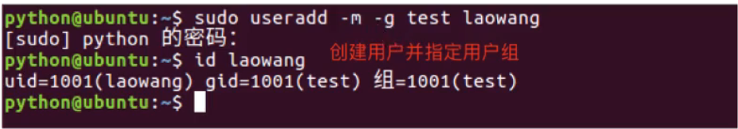
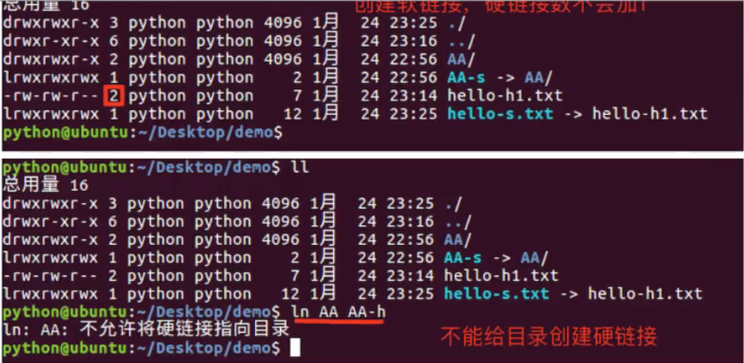
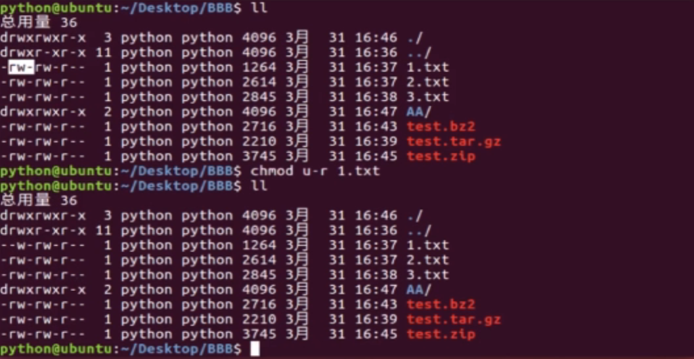

使用CTRL+ALT切换页面到真机,使用CTRL+ALT+ENTER进入退出全屏

使用CTRL+G定向到虚拟机

必须在虚拟环境中	执行命令


使用tree 命令查看文件的目录树win中也可以

在Windows环境的命令行下，tree 命令的默认行为和 Linux 稍有不同，它默认不包含文件，只显示目录结构。如果你想要显示文件，需要增加 /f 参数。
打开命令提示符（或者 PowerShell）
导航到你的 Django 项目目录
运行 tree /f 命令

使用pwd 查看当前的工作目录的路径


PS D:\IdeaProject\django_learn_blackhrose\django_project\django_project> cd ..
PS D:\IdeaProject\django_learn_blackhrose\django_project> tree /f
卷 Data 的文件夹 PATH 列表
卷序列号为 D29C-B81A
D:.
│  manage.py
│
├─.idea
│      .gitignore
│      workspace.xml
│
├─django_project
│      asgi.py
│      settings.py
│      urls.py
│      wsgi.py
│      __init__.py
│
└─templates

cp 复制文件 -r (r表示recursive递归,复制整个文件目录和目录下的所有文件)

cat 文件名	(连接文件并输出到终端)

rm 删除 -r 递归 -f 强制

scp 安全复制

apt update

apt-get

apt install

snap install node classic

1. apt (适用于 Debian-based 系统，如 Ubuntu)：
  安装软件包：sudo apt install package_name

2. 移除软件包：sudo apt remove package_name

3. 更新软件包列表：sudo apt update

4. 升级已安装的软件包：sudo apt upgrade

5. 设置包源： 使用文本编辑器打开 /etc/apt/sources.list 文件，可以看到类似如下的条目：

  deb http://us.archive.ubuntu.com/ubuntu/ focal main restricted

6. yum (适用于 Red Hat-based 系统，如 CentOS)：
   安装软件包：sudo yum install package_name

7. 移除软件包：sudo yum remove package_name

8. 更新软件包列表：sudo yum check-update

9. 升级已安装的软件包：sudo yum update

10. 设置包源： Yum 的源是存储在 /etc/yum.repos.d/ 目录下的 .repo 文件中的。默认的文件是 CentOS-Base.repo，你可以编辑这些文件来修改源。编辑后，可以通过运行 sudo yum clean all && sudo yum makecache 来让新的配置生效。

11. wget：
   Wget 主要用于从网络下载文件，比如：wget http://example.com/file.iso

## 软件安装

### 软件安装的格式

- 离线安装(deb文件格式安装)
- 在线安装(apt-get方式安装)

### deb文件格式安装

是ubuntu的安装包格式,可以使用**dpkg**命令进行软件的安装和卸载

| 命令 | 说明                |
| ---- | ------------------- |
| dpkg | 安装和卸载deb安装包 |

#### dpkg命令选项:

| 选项 | 说明              |
| ---- | ----------------- |
| -i   | 离线安装deb安装包 |

### apt-get方式安装

在线安装软件命令格式为:

`sudo apt-get install 安装包`,表示在线安装deb安装包

### deb文件格式卸载

#### 命令格式:

`sudo dpkg -r 安装包名` -r 表示安装的卸载

### apt-get 方式卸载

#### 命令格式:

__sudo apt-get remove 安装包名__

## 压缩和解压缩命令

### 压缩格式的介绍

Linux默认支持的压缩格式:

- .gz
- .bz2
- .zip

#### 说明:

+ .gz 和 .bz2的压缩格式的压缩包需要使用命令tar来压缩和解压缩
+ .zip的压缩包需要使用zip来压缩,使用unzip命令来解压缩

### tar命令和选项的使用

| 命令 | 说明             |
| ---- | ---------------- |
| tar  | 压缩和解压缩命令 |

#### tar命令选项:

| 选项 | 说明                              |
| ---- | --------------------------------- |
| -c   | 创建打包文件                      |
| -v   | 显示打包或者解包的详细信息        |
| -f   | 指定文件名称,必须放到所有选项后面 |
| -z   | 压缩或解压缩(.gz)                 |
| -j   | 压缩或解压缩(.bz2)                |
| -x   | 解包                              |
| -C   | 解压缩到指定目录                  |

### zip和unzip命令和选项的使用

| 命令  | 说明               |
| ----- | ------------------ |
| zip   | 压缩成.zip格式文件 |
| unzip | 解压缩.zip格式文件 |

####  unzip命令选项:

| 选项 | 说明             |
| ---- | ---------------- |
| -d   | 解压缩到指定目录 |


一、压缩文件

    压缩单个文件：使用gzip命令，压缩单个文件。压缩后的文件扩展名为.gz。

gzip filename

    压缩目录：使用tar命令，将目录中的所有文件压缩为一个文件。压缩后的文件扩展名为.tar.gz。

tar -zcvf filename.tar.gz directory_name

将directory_name文件中的所有内容压缩到filename名的压缩文件中 

二、解压文件

    解压单个文件：使用gzip命令，解压单个文件。

gzip -d filename.gz

    解压tar文件：使用tar命令，解压tar文件。

tar -xvf filename.tar

    解压tar.gz文件：使用tar命令，解压tar.gz文件。

tar -zxvf filename.tar.gz

__注意:__使用参数-zcvf表示要压缩,使用参数zxvf表示解压缩,-jzvf表示压缩成.bz2的格式文件

`tar -zxvf filename.tar.gz -C 解压到的指定目录`

`zip 压缩后的文件名称 要压缩的文件(可以填写*.txt)`将文件压缩成zip格式

`unzip 解压的文件`(默认情况下解压到zip文件所在目录下)

`unzip test.zip -d 解压后需要放置的文件路径`(使用unzip解压文件并指定解压后的目录)

#### 小结

+ .gz和.bz2的文件使用tar命令完成压缩和解压缩
+ .zip的压缩文件使用zip和unzip命令完成压缩和解压缩


Linux系统中，.sh文件是一种脚本文件，它包含了命令和参数，可以让用户自动执行一系列操作，比如安装软件、编译代码等。但是，很多新手对于如何打开.sh文件感到困惑。本文将介绍的几种方法。

方法一：命令行打开.sh文件

在Linux系统中，命令行是最基本的操作界面。通过命令行打开.sh文件很简单，只需要在终端中输入以下命令：

`sh /path/to/script.sh`

其中，/path/to/script.sh是你要打开的脚本文件的路径。

如果你想要在前台运行脚本文件，可以使用以下命令：

`bash /path/to/script.sh`
在Linux中，bash是一种应用程序，它可以启动一个新的shell进程，并在其中执行脚本文件。这里的bash命令和上面的sh命令实现的功能是一样的，只是使用了不同的shell进程。

方法二：在文件管理器中打开.sh文件
如果你不想使用命令行打开.sh文件，也可以在文件管理器中打开它。在Linux中，不同的文件管理器有不同的操作方式。这里我们以GNOME文件管理器为例。打开GNOME文件管理器。然后，找到要打开的.sh文件，右键单击它，选择“属性”菜单项。在属性对话框中，选择“权限”选项卡，勾选“允许作为程序运行”，然后单击“关闭”按钮。

现在，你可以双击这个.sh文件，就可以直接运行它了。如果你想要在终端中运行这个.sh文件，可以按住Shift键并单击该文件，然后选择“在终端中打开”菜单项。

方法三：使用文本编辑器打开.sh文件

如果你只是想浏览.sh文件的内容，而不是运行它，那么可以使用文本编辑器打开它。在Linux系统中，有许多文本编辑器可供选择，比如vi、emacs和nano等。这里我们以nano为例。

在终端中输入以下命令：

“`

nano /path/to/script.sh

“`

其中，/path/to/script.sh是你要打开的.sh文件的路径。然后，你就可以在nano文本编辑器中看到.sh文件的内容了。如果你想要保存修改，可以按下Ctrl+O组合键保存，然后按下Ctrl+X组合键退出nano编辑器。

方法四：设置.sh文件的执行权限

在Linux系统中，对于一个.sh文件，只有它被赋予执行权限才能被运行。如果你尝试运行一个没有执行权限的.sh文件，系统会提示“权限被拒绝”的错误信息。因此，在使用.sh文件之前，你需要设置它的执行权限。
在终端中输入以下命令：

`chmod +x /path/to/script.sh`

其中，/path/to/script.sh是你要设置的.sh文件的路径。这个命令中的“+x”选项表示给.sh文件增加执行权限。如果你想要查看一个.sh文件的当前权限，可以使用以下命令：

`ls -l /path/to/script.sh`

其中，-l选项表示以长格式输出文件列表。在输出结果中，你可以看到该文件的权限属性。本文介绍了的四种方法：命令行打开、文件管理器中打开、使用文本编辑器打开和设置文件权限。对于Linux新手来说，学习如何打开.sh文件是一个很好的起点，它可以让你进一步了解Linux系统的操作。希望本文能够对你有所帮助。


### 重定向(也叫做输出重定向,将终端中显示出的内容重定向到文件中,写入文件)

| 命令 | 说明                                                         |
| ---- | ------------------------------------------------------------ |
| >    | 如果文件存在会覆盖文件中原有的内容,相当于文件操作中的'w'模式 |
| >>   | 如果文件存在则会追加写入文件末尾,相当于文件操作中的'a'模式   |

- 终端内容保存到文件中使用重定向只有两种方式:>和>>
- \>表示每次只是写入最新数据,原有的数据不保留
- \>>表示每次在原有的数据基础上进行追加,原有的数据会保留,和python中文件相关的处理方式实质上一样
- `ls /home > 1.txt`

#### 创建,删除文件及目录命令

| 命令              | 说明               |
| ----------------- | ------------------ |
| touch 文件名      | 创建指定文件       |
| mkdir 目录名      | 创建目录(文件夹)   |
| rm 文件名或目录名 | 删除指定文件或目录 |
| mkdir 目录名      | 删除空目录         |

> 使用ctrl+shift+'+'能够实现终端的字体方法和缩小
>
> 使用rmdir 文件夹名 的方式也能够删除目录
>
> 使用touch xxx创建文件,在文件没有指定路径的情况下相当于直接创建在当前文件夹中,但是如果想要弄在相对路径中需要使用./xxx/文件名的方式创建文件,当然也可以直接指定文件的绝对路径,在绝对路径中直接使用 绝对路径/文件名 的方式创建文件

-r 参数在linux中一般是作为递归的作用,一般删除文件夹可以使用到

-l 参数一般作为显示内容,在终端中已每行的形式

 [] 表示可选参数

-a 可以显示出隐藏的文件和隐藏的目录

-h 以大小单位显示,默认显示的单位是字节

可以联合使用`ls -l -h`或者`ls -lh`或者`ls -hl`

#### 查看命令帮助

- --help 使用说明:命令 --help
- man 使用说明:man 命令

> `rm xx -r`
>
> rm --help
>
> rm -h
>
> man rm(使用man命令按b向上翻页,使用回车enter和空格键能够下翻页,使用f也能够向下翻页,使用q退出) 

#### mkdir命令选项

| 命令选项 | 说明                |
| -------- | ------------------- |
| -p       | 创建所依赖的文件夹📂 |

> 创建所依赖的文件夹,指的是创建子目录,如果子目录前有父目录的路径要求,那么在子目录中必须将父目录中路径补充完整,如果不想手动创建相关文件路径,而是需要直接创建则需要使用 -p 参数


#### rm命令选项

| 命令选项 | 说明                                 |
| -------- | ------------------------------------ |
| -i       | 交互式提示                           |
| -r       | 递归删除目录及其内容                 |
| -f       | 强制删除,忽略不存在的文件夹,无需提示 |
| -d       | 删除空目录                           |

#### 切换目录

| 命令    | 说明                   |
| ------- | ---------------------- |
| cd 目录 | 切换到指定目录         |
| cd ~    | 切换到当前用户的主目录 |
| cd ..   | 切换到上一级目录       |
| cd .    | 切换到当前目录         |
| cd -    | 切换到上一次目录       |

- cd 后不写目录等价于cd ~


#### 复制,移动和目录命令的使用

| 命令 | 说明                                                     |
| ---- | -------------------------------------------------------- |
| cp   | 拷贝文件,拷贝目录                                        |
| mv   | 移动文件,移动目录,重命名(只能将同一级目录下的文件重命名) |

- 拷贝目录需要加上参数-r 选项,-r表示递归拷贝目录及其内容

###cp命令选项

| 命令选项 | 说明                                                         |
| -------- | ------------------------------------------------------------ |
| -i       | 交互式提示                                                   |
| -r       | 递归拷贝目录及其内容                                         |
| -v       | 显示拷贝后的文件路径描述                                     |
| -a       | 保留文件的原有权限(主要针对的是其他用户角色的权限)也可以拷贝文件夹 |

__注意:__如果直接使用-r的方式递归拷贝文件夹中的内容,拷贝的数据是正常的,但是权限会丢失,所以可以使用-a参数,实现对文件夹的拷贝


## 用户相关操作 

#### 创建用户

| 命令    | 说明           |
| ------- | -------------- |
| useradd | 创建(添加)用户 |

##### useradd命令选项:

| 选项 | 说明                                                      |
| ---- | --------------------------------------------------------- |
| -m   | 自动创建用户的主目录,主目录的名字就是用户名               |
| -g   | 指定用户所属的用户组,默认不指定会自动创建一个同名的用户组 |

`sudo useradd -m xxx`

 

#### 设置密码

给其他用户设置密码,需要使用: ==sudo passwd 用户名==


#### 切换用户

| 说明 | 命令     |
| ---- | -------- |
| su   | 切换用户 |

##### 语法格式:su - 用户名

> 可以使用`id 用户名`的方式查看用户信息


#### 修改用户信息

| 命令    | 说明         |
| ------- | ------------ |
| usermod | 修改用户信息 |

##### usermod选项:

| 命令 | 说明                                                         |
| ---- | ------------------------------------------------------------ |
| -G   | 设置一个附加组 `sudo usermod -G sudo laowang`(能够给予新创建的用户,设置附加组sudoroot权限) |
| -g   | 修改用户组(主组)                                             |

在当前的用户下,如果可以提升到root使用`sudo -s`能够将shell提升到root权限,切换至管理员


#### 删除附加组

| 命令    | 说明                 |
| ------- | -------------------- |
| gpasswd | 添加和删除附加组信息 |

##### gpasswd命令选项:

| 选项      | 说明             |
| --------- | ---------------- |
| -a 用户名 | 给用户添加附加组 |
| -d 用户名 | 给用户删除附加组 |

`sudo gpasswd -d laowang sudo` 从附加组中删除用户


#### 删除用户

| 命令    | 说明     |
| ------- | -------- |
| userdel | 删除用户 |

##### userdel命令选项:

| 选项      | 说明                                             |
| --------- | ------------------------------------------------ |
| -f 用户名 | 删除用户主目录,必须要设置,否则用户主目录不会更新 |

- 创建用户命令格式:`sudo useradd -m 用户名`,默认会创建一个同名的用户组。
- 查看用户信息使用 id 命令或者 `/etc/passwd`文件
- 查看用户组信息使用 `/etc/group`文件
- 给用户设置密码使用 `sudo passwd` 用户名
- 切换用户使用 `su - 用户名`
- 设置附加组使用 `sudo usermod -G` 组名 用户名(能够设置出root权限)
- 删除用户使用 `sudo userdel -r` 用户名，默认会删除同名的用户组


## 用户组相关操作

### 创建用户组

| 命令     | 说明             |
| -------- | ---------------- |
| groupadd | 创建(添加)用户组 |

默认情况下,如果不手动创建用户组,那么用户组就是用户名

==注意==:在将用户划分组前,必须先创建出用户组,`sudo groupadd 用户组名` 

### 创建用户并指定用户组

`sudo useradd -m -g 用户组名 用户名`(附加组)



### 修改用户组信息

`sudo usermod -g 用户组名 用户名`

`sudo usermod -G 主组名 用户名`

### 删除用户组

`sudo groupdel 用户组名`

> 如果在删除用户组时出现异常,则需要先删除用户,才能删除该用户组
>
> `sudo userdel -r 用户名`使用递归的方式删除用户和用户的相关主文件夹


## 查看文件内容

### 查看文件内容命令的使用

| 命令 | 说明                                                  |
| ---- | ----------------------------------------------------- |
| cat  | 查看小型文件(在终端一页就能显示出来) vi 也行 vim 也行 |
| more | 分屏查看大型文件                                      |

cat 查看文件的方式是只读,但是不能写入

gedit xxx文件名 能够和vi 相似,可以查看文件的详细信息,也可以修改文件的信息

### 管道|(保存终端数据的容器)

将终端保存的内容,暂存在管道中,并可以使用管道查看

`ls /bin | more`


## 链接命令

链接命令是创建链接文件,链接文件分别为:

- 软链接
- 硬链接

| 命令  | 说明       |
| ----- | ---------- |
| ln -s | 创建软链接 |
| ln    | 创建硬链接 |

### 软链接

类似于==Windows中的快捷方式==,当一个源文件的目录层级比较深,想要方便使用可以给源文件创建一个软链接

`ln -s info.txt info-s.txt`(这是同级目录下的) 软链接命令 文件 链接后的文件名称

当在不同的目录中要创建软链接时需要源文件使用目录的绝对路径
`ln -s /home/python/AAA AAA-s`

ll 是 ls -la 的命令简称 ls -a -l

==注意点:==

- 如果软链接和源文件不在同一个目录,源文件要使用绝对路径,不能使用相对路径
- 删除源文件则软链接失效
- 可以给目录创建软链接
- 创建软链接的命令格式:ln -s 源文件路径(使用绝对路径) 软链接文件名(可以使用绝对路径)

### 硬链接

类似于==源文件的一个别名==,两个名字指向同一个文件数据.

**硬链接**可以保证文件中的数据防止误删`ln hello.txt hellp.txt`

在硬链接中如果将源文件改名或者删除,是不影响硬链接后的数据,删除源文件,不会影响硬链接文件,因为硬链接文件不依赖于源文件,直接指向文件中的数据

> 在硬链接中,一个文件修改了,那么整体的文件都将被修改,并且文件间的删除互不影响

__注意:__

- 我们可以给目录创建软链接,但是不能给目录创建硬链接
- 创建硬链接使用相对路径和绝对路径都可以
- 删除源文件,硬链接还是可以访问到数据
- 创建硬链接,硬链接数会加一,删除源文件或者硬链接,硬链接数目会减少1
- 创建软链接,硬链接数不会加1

__硬连接数:__硬链接数就是文件数据被文件名使用的次数,好比引用次数,使用命令 `ll`能够查看硬链接的个数




## 文本搜索

### grep命令的使用

| 命令 | 说明     |
| ---- | -------- |
| grep | 文本搜索 |

```shell
cat hello.py
grep "aa" hello.py # 使用grep实现过滤的功能
```

### grep命令选项的使用

| 命令选项 | 说明                                                   |
| -------- | ------------------------------------------------------ |
| -i       | 忽略大小写                                             |
| -n       | 显示匹配行号                                           |
| -v       | 显示不包含匹配文本的所有行(对所有的搜索的内容进行取反) |

### grep命令结合正则表达式的使用

| 正则表达式 | 说明                   |
| ---------- | ---------------------- |
| ^          | 以指定字符串开头       |
| $          | 以指定字符串结尾       |
| .          | 匹配一个非换行符的字符 |

`grep "k.f" 2.txt -n`

### 拓展

- grep 命令还可以文本搜索管道中的内容,比如:`ls /|grep 'lib'`
- 在使用grep命令时可以省略搜索内容的引用,比如:`ls /|grep lib,grep hello 1.txt`

### 小结

- grep命令是完成文本搜索的
- 文本搜索的命令格式:grep 选项 文本搜索内容


## 查找文件命令

### find命令及其选项

| 命令     | 说明                           |
| -------- | ------------------------------ |
| find     | 在指定命令下查找文件(包括目录) |
| __选项__ | __说明__                       |
| -name    | 根据文件名(包括子目录名)查找🔍  |

`find . -name '11.txt'`.表示在当前目录,搜索根据name '11.txt

### find命令结合通配符的使用

#### 通配符:

是一种特殊语句,主要有星号(\*)和问号(?),来用作模糊搜索

| 通配符 | 说明                        |
| ------ | --------------------------- |
| \*     | 代表0个字符或者任意多个字符 |
| ?      | 代表任意一个字符            |

#### 拓展:

通配符不仅能结合find命令使用,还可以结合其他命令使用,比如:**ls**,__mv__,**cp**等,但是只有find命令使用通配符需要添加引号


## 文件权限命令

### chmod 命令的介绍

| 命令  | 说明         |
| ----- | ------------ |
| chmod | 修改文件权限 |

chmod修改文件权限有两种方式:

- 字母法
- 数字法

### chmod字母法的使用

#### 角色说明

| 角色 | 说明                    |
| ---- | ----------------------- |
| u    | user,表示该文件的所有者 |
| g    | group,表示用户组        |
| o    | other,表示其他用户      |
| a    | all,表示所有用户        |

#### 权限设置说明

| 操作符 | 说明     |
| ------ | -------- |
| +      | 增加权限 |
| -      | 撤销权限 |
| =      | 设置权限 |

#### 权限说明

| 权限 | 说明       |
| ---- | ---------- |
| r    | 可读       |
| w    | 可写       |
| x    | 可执行     |
| -    | 无任何权限 |



> 使用ll查看文件的相关权限和拥有者,发现文件的拥有者是叫做python,此时如果我们的需求是将文件的权限降低,比如说去除文件的可读权限,所以需要将文件的拥有者的权限降低,`chmod u-r 1.txt`,其中-r表示去除文件的可读权限,1.txt是指定的要操作的文件;
>
> 反之,为文件增加可读权限,可以使用chmod u+r 1.txt

#### 拓展

关于.py文件的执行可以使用`python xxx.py|python3 xxx.py`也可以使用`./xxx.py`
__注意:__在win10中的powershell没有办法使用touch命令创建文件,但是可以使用type命令创建,但是type和cat是一个命令,所以可以使用`ni`创建文件,比如`ni foo.java`,命令会在当前目录下创建一个空文件，如果要指定文件的路径，可以在文件名前加上盘符和目录，例如：`ni c:\test\foo.java`,如果要向文件中写入内容，可以使用`echo`命令，例如：`echo 'public class Foo {}' > foo.java`,这个命令会在文件中写入一行代码。也可以使用管道符（|）来连接多个命令，例如：`ni foo.java | echo 'public class Foo {}' > foo.java`;可以在使用ni 创建文件后,使用notepad xxx打开文件,并编辑文件保存,最后使用./xxx.py运行,但是也可以使用.\xx在windos环境中运行

如果执行的时候报错,是没有指定python的解释器,需要在代码中添加注释在第一行

```python
#!xx解释器目录
#声明代码会使用什么解释器执行
print(111)
```


> 使用`which`可以查看文件在哪个目录下,在linux中,`which python3`
>
> 在win中可以使用where xxx查找

在python中#的作用:当作注释内容,#\__\*\_\_coding:utf-8\_\_\*\__ 表示指定文件编码格式,#!/python解释器的路径 表示操作系统直接执行文件选择的解释器

`chmod a=rwx 1.txt` 	`chmod u=rw,g=r,o=w`

### chmod数字法的使用

数字法就是"rwx"这些权限可以使用__数字来替代__

#### 权限说明

| 权限 | 说明                 |
| ---- | -------------------- |
| r    | 可读,权限是4         |
| w    | 可写,权限是2         |
| x    | 可执行,权限值是1     |
| -    | 无任何权限,权限值是0 |

`chmod 777 1.txt`


## 获取管理员权限的相关命令

### sudo命令的使用

| 命令    | 说明                                               |
| ------- | -------------------------------------------------- |
| sudo -s | 切换到root用户,获取管理员权限                      |
| sudo    | 某个命令执行需要获取管理员权限可以在执行前加上sudo |

### whoami命令的使用

| 命令   | 说明         |
| ------ | ------------ |
| whoami | 查看当前用户 |

### exit命令的使用

| 命令 | 说明         |
| ---- | ------------ |
| exit | 退出登录用户 |

### who命令的使用

| 命令 | 说明               |
| ---- | ------------------ |
| who  | 查看所有的登录用户 |

### passwd命令的使用

| 命令   | 说明                                              |
| ------ | ------------------------------------------------- |
| passwd | 修改用户密码,不指定用户默认修改当前登录的用户密码 |

### which命令的使用

| 命令  | 说明         |
| ----- | ------------ |
| which | 查看命令位置 |

### 关机和重启命令

| 命令            | 说明     |
| --------------- | -------- |
| shutdown -h now | 立即关机 |
| reboot          | 重启     |


## 远程登录,远程拷贝命令

### 远程登录,远程拷贝命令

| 命令 | 解释     |
| ---- | -------- |
| ssh  | 远程登录 |
| scp  | 远程拷贝 |

### 软件安装步骤

1. 如果使用linux作为服务器,需要安装ssh服务端软件,执行命令:**sudo apt-get install openssh-server** 使用apt list 查看已安装的软件
2. 如果客户端使用的是macOS则不需要安装ssh客户端软件,默认已经安装过,可以直接使用ssh
3. 客户端是windows需要安装软件OpenSSH for Windows这个软件

__ssh命令格式:__

ssh用户名@ip地址


## 编辑器vim

### vim的工作模式

- 命令模式
- 编辑模式
- 末行模式

__说明__:
vim打开文件进入是命令模式

按下键盘i进入编辑模式,按下esc退出编辑模式回到命令模式

在命令模式下按下:进入末行模式,使用esc退出返回到命令模式

### vim的末行模式

- :w 保存
- :wq 保存并退出
- :x 保存退出
- q!强制退出

### vim常用命令

| 命令                                          | 说明               |
| --------------------------------------------- | ------------------ |
| yy                                            | 复制光标所在行     |
| p                                             | 黏贴               |
| dd                                            | 删除/剪切当前行    |
| V                                             | 按行选中           |
| u                                             | 撤销               |
| ctrl+r                                        | 反撤销             |
| >>                                            | 向右缩进           |
| <<                                            | 向左缩进           |
| :/搜索的内容(带有:的是在末行模式下)           | 搜索指定内容       |
| :%s/要替换的内容/替换后的内容/g               | 全局替换           |
| :开始行数,结束行数s/要替换的内容/替换后的内容 | 局部替换           |
| .                                             | 重复上一次命令操作 |
| G                                             | 回到最后一行       |
| gg                                            | 回到第一行         |
| 数字+G                                        | 回到指定行         |
| shift+6                                       | 回到当前行的行首   |
| shift+4                                       | 回到当前行的行末   |
| ctrl+f                                        | 下一屏             |
| ctrl+b                                        | 上一屏             |
| 按下n                                         | 下一个筛选条件     |
| 按下shift+N                                   | 回到上一个筛选条件 |


