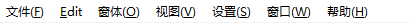

# Qt Designer第一课基础使用

### 认识Qt Designer

>- 常用的窗口类型
>
>- Qt Designer窗口区域
>
>  - 菜单栏
>
>    
>
>  - 工具栏
>
>    
>
>  - 工具箱
>
>  - 窗口设计区域
>
>  - 对象查看器
>
>  - 属性查看器
>
>  - 信号/槽编辑器
>
>    `将代码于槽函数交互,使得事件发生`
>
>  - 动作编辑器
>
>    `对控件的动作进行编辑,包括将鼠标放上时显示文字,显示图片等`
>
>  - 资源浏览器
>
>    `为控件添加图片背景,图标资源等`

### 创建窗口

>- MainWindows:一个带有菜单栏,工具栏和状态栏的主窗口
>
>- 步骤
>
>  1. 创建主窗口
>
>     点击可以创建一个新的窗口页面,或者在菜单栏的文件中点击新建子菜单
>
>  2. 设计主窗口
>
>  3. 预览窗口效果
>
>     `使用Ctrl+r查看控件在窗口中的基本效果`
>
>  4. 查看Python代码
>
>  5. 将.ui转换为.py'
>
>     `使用PyUIC外部工具将ui文件转换为py文件`
>
>  6. 运行主窗口

