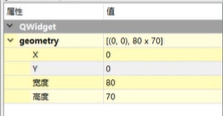

# Qt 第二课属性相关

>|            属性             |                             说明                             |
>| :-------------------------: | :----------------------------------------------------------: |
>|         objectName          |            窗口的唯一标识，程序通过该属性调用窗口            |
>|          geometry           |               该属性中可以设置窗口的宽度和高度               |
>|         windowTitle         |                       窗口的标题栏文本                       |
>|         windowlcon          |                    窗口的左上角标题栏图标                    |
>|        windowOpacity        |                  窗口的透明度，取值范围0~1                   |
>|       windowModality        |  窗口样式，可选值有NonModal、WindowModal和ApplicationModal   |
>|           enabled           |                         窗口是否可用                         |
>|         mininumSize         |                窗口最小化时的大小，默认为0x0                 |
>|         maximumSize         |         窗口最大化时的大小，默认为16777215*16777215          |
>|           palette           |             窗口的调色板，可以用来设置窗口的背景             |
>|            font             | 设置窗口的字体,包括字体的名称,大小,是否粗体,是否斜体,是否下划线,删除线等 |
>|           cursor            |                        窗口的鼠标样式                        |
>|      contextMenuPolicy      |                      窗口的快捷菜单样式                      |
>|         acceptDrops         |                       是否接受拖放操作                       |
>|           toolTip           |                        窗口的提示文本                        |
>|       toolTipDuration       |                    窗口提示文本的显示间隔                    |
>|          statusTip          |                        窗口的状态提示                        |
>|          whatsThis          |                     窗口的“这是什么”提示                     |
>|       layoutDirection       | 窗口的布局方式，可选值有LeftToRight.RightToLeft和LayoutDirectionAuto |
>|     autoFillBackground      |                       是否自动填充背景                       |
>|         styleSheet          |             设置窗口样式，可以用来设置窗口的背景             |
>|           locale            |                        窗口国际化设置                        |
>|          iconSize           |                     窗口标题栏图标的大小                     |
>|       toolButtonStyle       | 窗口中的工具栏样式,默认值ToolButtonOnly,表示默认工具栏中只显示图标用户可以更改为只显示文本或者同时显示文本和图标 |
>|         dockOptions         |                           停靠选项                           |
>| unifiedTitleAndToolBarOnMac |            在Mac OS系统中是否可以定义标题和工具栏            |
>|                             |                                                              |

> 使用geometry属性在控件上,可以设置控件距离窗口的坐上角的距离,分别是由X,Y设置,高度和宽度设置的是控件的宽和高