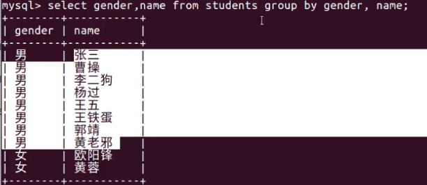
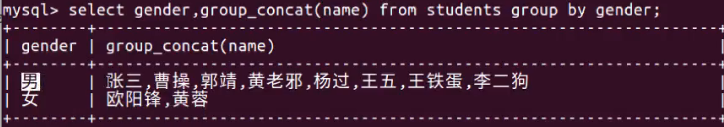

## 分组查询

### 分组查询的介绍

分组查询就是将查询结果按照指定字段进行分组，字段中数据相等的分为一组。

__分组查询基本的语法格式如下:__

GROUP BY 列名[HAVING 条件表达式]WITH ROLLUP]

__说明:__

- 列名:是指按照指定字段的值进行分组。
- HAVING条件表达式:用来过滤分组后的数据。
- WITH ROLLUP(对所有的记录进行汇总):在所有记录的最后加上一条记录,显示select查询时聚合函数的统计和计算结果

### group by 的使用

group by 可以用于单个字段分组,也可以用于多个字段分组

```sql
根据gender字段来分组-
select gender from students group by gender;
-- 根据name和gender字段进行分组
select name,gender from students group by name, gender;
```

####  例1:查询性别的种类

```sql
select distinct gender from students;
select gender from students group by gender; // 通过性别字段gender进行分组,注意在指定分组后,查询的关键字只能是指定分组的字段
错误❌:select gender,name from students group by gender;
指定的时候使用什么分组字段,那么在查询的时候只能使用什么字段,除非查询的字段和分组的字段一致

例外:选择分组列和聚合列（例如 count(*)、max(age) 等）。如果你想按 gender 分组并选择每组的 name，你需要使用某种聚合函数来决定每组选择哪个 name，或者添加额外的 GROUP BY 列。
在 GROUP BY 子句中使用的字段，都可以在 SELECT 查询中直接使用。除此之外，你也可以在 SELECT 查询中使用聚合函数，如 COUNT(), SUM(), AVG(), MAX(), MIN() 等等。
这些聚合函数可以用在任何字段上，无论它们是否出现在 GROUP BY 子句中

例如，以下两个查询将明确定义返回哪个 name：
select gender,name from students group by gender,name;// 使用后的代码图片
```



### group by + group_concat()的使用

(使用group_concat相当于使用了distinct将同种字段包裹的进行聚合实现了类似于去重的功能实现,去重只是相对于一个相同的字段,但是另外的不相同字段在group_concat()内)

group_concat(字段名): 统计每个分组指定字段的信息集合，每个信息之间使用逗号进行分割

#### 例2:查询性别的种类,并将重复的字段名进行集合

```sql
select gender,group_concat(name) from students group by gender;// 通过性别字段gender进行分组,将分组后的结果进行集合的整合
```



#### 例3:统计不同性别的平均年龄(不同性别:所以使用性别分组,平均年龄使用avg聚合函数)

```sql
select gender,avg(age) from students group by gender;
```

