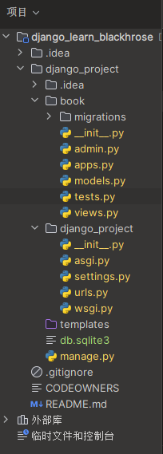
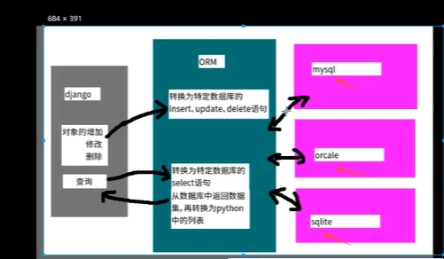
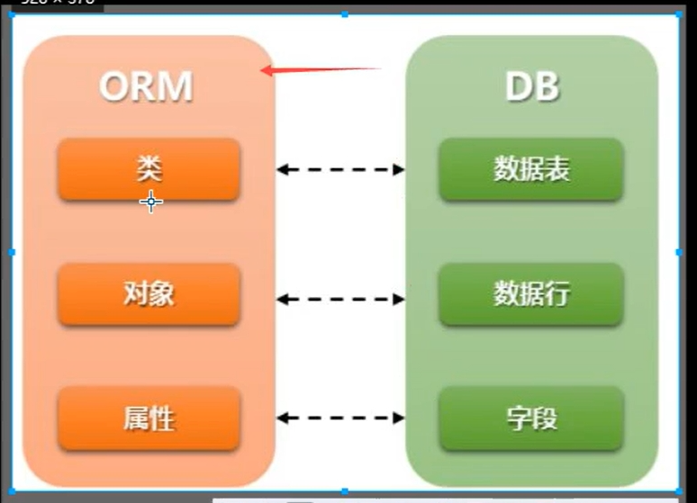
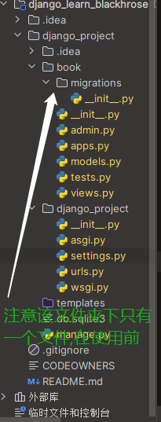
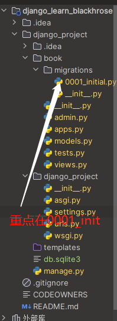
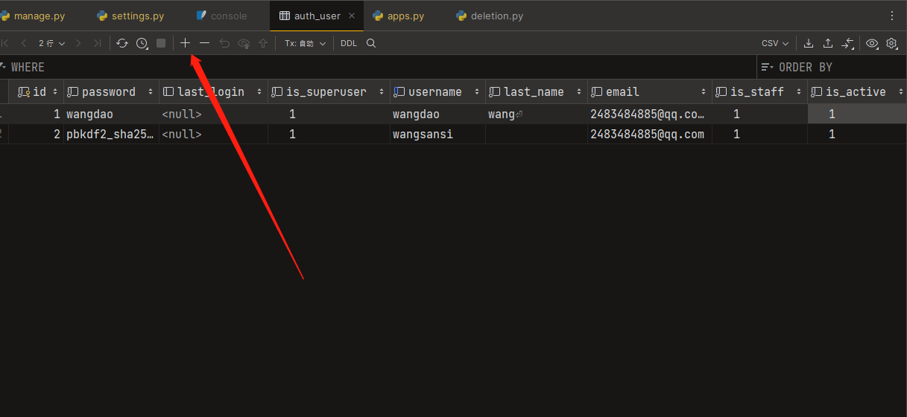

### 创建django项目

- 1.创建Django项目(也可以使用jebrain中的模板直接创建项目)
  - django-admin startproject name(项目名)
- 2.创建子应用
  - python manage.py startapp name(应用名)

1. 在创建django项目后使用,创建项目文件夹中的manage.py文件运行项目,需要移动到当前目录下
2. ==注意== :在运行manage.py文件时,不能使用python xx.py 的方式直接运行,需要使用 `python manage.py runserver` 的代码在控制台或终端中运行(或者是在idea中设置运行manage.py文件的参数,其中直接运行控制台显示提示,填入参数runserver)
3. 默认情况下,访问的地址是 `127.0.0.1:8000`




- admin.py 文件和网站的后台管理站点配置相关
- apps.py 文件用于配置当前子应用的相关信息
- migrations 目录用于存放数据库迁移历史文件
- models.py 文件用户保存数据库模型类
- tests.py 文件用于开发测试用例,编写单元测试
- views.py 文件用于编写Web应用视图


#### 在将子应用注册到项目文件中

在创建子应用后需要绑定子应用,在创建的主要应用中,移动到setting.py文件中,在文件的INSTALLED_APPS列表中保存相关的信息,在子应用中apps.py文件中的BookConfig  



数据库和ORM对象关系映射的关系




### 修改数据库的类型

> ```python
> # Database
> # https://docs.djangoproject.com/en/3.2/ref/settings/#databases
> 
> DATABASES = {
>     'default': {
>         'ENGINE': 'django.db.backends.sqlite3', # 需要修改数据库的类型则需要在主应用的settings.py文件中DATABASES选项中修改,将sqlite3.的后缀更改为需要的数据库类型的后缀
>         'NAME': BASE_DIR / 'db.sqlite3',
>     }
> }
> ```

#### 更改后的数据库类型如下，更改成mysql数据库

> ```python
> # Database
> # https://docs.djangoproject.com/en/3.2/ref/settings/#databases
> 
> DATABASES = {
>     'default': {  # ENGINE 就是ORM
>         'ENGINE': 'django.db.backends.mysql',
>         'HOST': '127.0.0.1',  # 主机IP
>         'PORT': '3306',  # 主机端口
>         'USER': 'root',  # 用户名
>         'PASSWORD': 'wjr107024',  # 密码
>         'NAME': 'book',  # 数据库名
>     }
>     # 'default': {
>     #     'ENGINE': 'django.db.backends.sqlite3',
>     #     'NAME': BASE_DIR / 'db.sqlite3',
>     # }
> }
> ```

#### 手动创建新的数据库，注意这里的数据库名需要和django项目中数据库名相同

`CREATE DATABASE bookmanage_9_19 CHARACTER SET utf8;`

### 使用Django进行数据库开发的步骤:(在更换数据库或者修改数据库中的数据后)

1. 定义模型类 在子类的model.py文件中,继承于model.Model基类
2. 模型迁移
3. 操作数据库

定义模型类

- 在子文件夹的models编写模型类的代码,可以使用可以定义出数据库的表的内容填写,直接使用models模块中的类进行编写,之后进行数据库的模型迁移即可 

模型迁移(建表)

- 迁移两步完成:

  - 生成迁移文件:根据模型类生成创建表的语句,将类转换为表结构文件

    ```shell
    python manage.py makemigrations
    ```

  - 执行迁移:根据第一步生成的语句在数据库中创建表,执行表结构文件,这时候数据库产生表

    ```shell
    python manage.py migrate
    ```
    
  - 使用帮助

  - ```
    python manage.py --help
    ```

    

- 迁移前

  

> 使用命令 python manage.py makemigrations 提示 No changes detected 未检测到变化 
> PS D:\IdeaProject\django_learn_blackhrose\django_project> python .\manage.py makemigrations    
> No changes detected
>
> 原因:未注册相关子应用的绑定在setting中
>
> 修改使用后控制台显示: 
>
> PS D:\IdeaProject\django_learn_blackhrose\django_project> python .\manage.py makemigrations    
> Migrations for 'book':
>   book\migrations\0001_initial.py
>    - Create model BookInfo
>
>    - Create model PeopleInfo
>
>      ==注意:==在注册子应用后可以进行模型的迁移,不注册此应用在迁移的时候系统检测不到

- 生成迁移文件后

  

- 执行迁移文件

  > 使用下面的命令进行模型的迁移
  >
  > ```shell
  > python manage.py migrate
  > ```
  >
  > PS D:\IdeaProject\django_learn_blackhrose\django_project> python manage.py migrate
  > Operations to perform:
  >   Apply all migrations: admin, auth, book, contenttypes, sessions
  > Running migrations:
  >   Applying contenttypes.0001_initial... OK
  >   Applying auth.0001_initial... OK
  >   Applying admin.0001_initial... OK
  >   Applying admin.0002_logentry_remove_auto_add... OK
  >   Applying admin.0003_logentry_add_action_flag_choices... OK
  >   Applying contenttypes.0002_remove_content_type_name... OK
  >   Applying auth.0002_alter_permission_name_max_length... OK
  >   Applying auth.0003_alter_user_email_max_length... OK
  >   Applying auth.0004_alter_user_username_opts... OK
  >   Applying auth.0005_alter_user_last_login_null... OK
  >   Applying auth.0006_require_contenttypes_0002... OK
  >   Applying auth.0007_alter_validators_add_error_messages... OK
  >   Applying auth.0008_alter_user_username_max_length... OK
  >   Applying auth.0009_alter_user_last_name_max_length... OK
  >   Applying auth.0010_alter_group_name_max_length... OK
  >   Applying auth.0011_update_proxy_permissions... OK
  >   Applying auth.0012_alter_user_first_name_max_length... OK
  >   Applying book.0001_initial... OK
  >   Applying sessions.0001_initial... OK

- 生成的数据库的表在哪里?
  - 观察子应用的setting.py文件,可以发现文件中的Database下是数据库的相关设置,默认情况下是sqlite3关系型数据库(可以更改为其余的关系型数据库)

### 视图层的编写(当执行数据库的迁移后)

- 选择子模块的views.py文件编写view层代码,定义视图函数,并且可以在views.py文件中实现数据库的增删改查操作

- 在编写完成视图函数index()后可以编写urls.py模块的编写,实现路由匹配

- ```
  urlpatterns = [
  	path(django.urls.path) # 此处使用alt+enter,之后可以导入一个外部库from django.urls import path
  	path('creat/',creat_book)
  ]
  ```

  __注意:__在使用子应用的视图层编写和子应用的路由匹配时,需要先在主应用中==urls.py==中将子应用的站点加入

  - 主应用中对于子应用的路由设置

  - ```
    设置路由相关信息
    from django.contrib import admin
    from django.urls import path,include
    # from book.views import index
    urlpatterns = [
        path('admin/', admin.site.urls),
        path('',include('book.urls')) # 在每个子应用中添加路由名,include..实际上是 项目路由名+/book.urls中的urls中的路由名
        # path('index/', index), # 视图函数中的函数名,不是完整函数,添加规则进行路由匹配
    ]
    ```

  在子应用的views.py视图模块中编写导入子应用中的视图中的查询

  ```
  from django.http import HttpResponse
  from django.shortcuts import render
  from book.models import *
  
  
  # Create your views here.
  
  def index(reqest):
      # 在这里实现增删改查
      book = BookInfo.objects.all()
      print(book)
      return HttpResponse('index')
  
  
  '''
  貌似在django中所有关于数据库的增删改查都写在views层中???
  '''
  
  ##############增加数据到数据库###############
  
  # 注意无论使用哪一种方式向数据库中增加数据,如果相同的键已经创建了,再次使用会报错,引发异常,但是如果提前做好try..except能够解决
  # 使用一下的方式增加数据库表中的数据貌似并不是创建新的表,因为创建数据库中的新表是在modles文件中创建的
  # 使用下面的django ORM方式向数据库表中添加文件,貌似只是插入数据,相当于Insert into 表名(字段名) values(值)   也就是增加数据库中的某个实体的属性
  # with connection.cursor() as cursor:
  #     cursor.execute("INSERT INTO my_model (name, description) VALUES (%s, %s)", ['Example', 'Description for example'])
  
  # 方式1
  # 创建models中的书籍类信息对象,当数据库中的键对象已经创建成功后,如果再次使用 数据库类名().save()方式会报错
  # 使用save()方法能够将数据保存在数据库中
  # book = BookInfo(
  #     name='Django',
  #     pub_date='2020-10-10',
  #     readcount=100,
  #     commentcount=100,
  # ).save() # 使用save方法将对象的数据保存到数据库中
  #
  # # 方式2
  # # 创建模型类对象,objects--相当于一个代理  实现增删改查,注意在使用这种方式创建数据库中的一个对象时,如果对象已经创建完成后,再次使用该方法则会报错
  # BookInfo.objects.create(
  #     name='Flask',
  #     pub_date='2020-10-10',
  #     readcount=100,
  #     commentcount=100,
  # )
  
  ######################修改数据######################
  
  # 方式1
  '''
  如果使用正常的sql方式执行,当然前提使用python的库执行sql
  with connection.cursor() as cursor:
      cursor.execute("SELECT * FROM my_model WHERE id = %s", [1])
      row = cursor.fetchone()
  '''
  # 下面这句话的意思相当于: select * from book_info where id=18 注意这里指的是get方法
  book = BookInfo.objects.get(id=18)
  # book.id = '6' # 貌似没有办法使用该方法修改常见的数据库中表的字段的id
  book.name = '运维开发入门'  # 注意在此处更改后数据库中的数据还没有变化,无论是在python shell中还是在实际的运行终端中
  book.save()  # 使用book的save()方法将数据保存在数据库中,此时数据库中的属性的值改变
  
  # 方式2
  # 使用filter过滤器后更新数据,只有filter具有方法update,get方法后面没有update()方法
  BookInfo.objects.filter(id=5).update(name='爬虫入门', commentcount=666)
  # 使用该命令后数据即被更新
  
  ####################删除数据################
  # 方式1
  # book = BookInfo.objectes.get(id=1)
  # 删除分为两种,一种是物理删除(物理删除是删除这个记录的数据),一种是逻辑删除(修改一个标记为 例如is_delete=False)
  # 其中物理删除是真正的删除找不到记录,但是逻辑删除不是
  # book.delete()
  # 删除后显示(6, {'book.PeopleInfo': 5, 'book.BookInfo': 1}),表示删除了6条数据分别在book数据库中的PeopleInfo表5条数据,以及在book数据库的BookInfo表1条数据
  # 注意在删除数据时不需要向修改一样使用save()方法保存
  
  # 删除方式2,相当于直接使用没有复制给一个变量保存,只能使用一次
  # BookInfo.objects.get(id=18).delete()
  
  # 方式3,使用filter过滤器中内置的删除方法delete()
  # BookInfo.objects.filter(id=18).delete()
  
  ##############查询数据####################
  # get 查询单一结果,如果不存在会抛出模型类,DoesNotExist异常,book.models.BookInfo.DoesNotExist: BookInfo matching query does not exist.表示的意思是BookInfo表中没有这参数对应查询的数据
  # get方式查询,如果存在这个属性对应的数据库表中的数据,就将获取到的数据返回
  try:
      book = BookInfo.objects.get(id=2)
  except BookInfo.DoesNotExist:
      print("查询结果不存在,可能数据库表中已经删除了相关的字段")
  
  # all查询多个结果,查询后的数据保存在列表当中
  books = BookInfo.objects.all()
  from book.models import PeopleInfo  # 从原型库中导出相关的数据库中的表的原型
  
  PeopleInfo.objects.all()
  # count 查询所有结果数量,以下两种方式都能够查询到数据库表中的数量,一种是使用all()方法,一种是直接使用count()方法
  BookInfo.objects.all().count()
  BookInfo.objects.count()
  
  ###################过滤查询################################
  # 完成SQL中的where功能,包括filter过滤出多个结果,形成列表的形式返回数据
  # exclude排除掉符合所有条件剩下的结果
  # get过滤单一结果
  
  # 语法形式
  # 模型类名.objects.filter(属性名__运算符=值) 括号内的相当于sql语法中的where条件查询语句   获取n个结果 n=0,1,2..
  # 模型类名.objects.exclude(属性名__运算符=值) 括号内的相当于sql语法中的where条件查询语句    获取n个结果 n=0,1,2..
  # 模型类名.objects.get(属性名__运算符=值) 括号内的相当于sql语法中的where条件查询语句    获取一个结果或者异常
  
  
  # 查询编号为2的图书
  book = BookInfo.objects.get(id=2)  # 简写形式(属性名=值)
  book = BookInfo.objects.get(id__exact=2)  # 完整形式,在Django框架中，__exact是一个Field lookup。它用于查询字段完全匹配的记录
  book = BookInfo.objects.get(pk=2)  # 其中参数中的pk指的是主键列为2的
  BookInfo.objects.filter(id=2)  # 使用filter得到的是一个列表,需要使用下标的方式能够实现和get一致的效果
  
  # 查询书名包含'湖'的书
  book = BookInfo.objects.filter(name__contains='湖')
  # 使用get方式查询也可以,但是使用get方式只有一个以xx包含的返回
  BookInfo.objects.get(name__contains='湖')
  
  # 查询书名以'部'结尾的书
  BookInfo.objects.filter(name__endswith='部')
  # 使用get的方式也能查询到以'x'结尾的数据
  BookInfo.objects.get(name__endswith='部')
  # 查询书名为空的图书
  BookInfo.objects.filter(name__isnull=True)  # 当isnull为False时候表示有值
  # 使用filter查询数据时即使没有数据也不会像get方式一样爆出异常,应为filter可以返回一个空列表
  # 使用get方式也可以,但是也只能查询到一个
  
  # 查询编号为1或3或5的图书,如果使用正常的sql语句表示为 select * from bookinfo where id in (1,3,5);
  BookInfo.objects.filter(id__in=(1, 3, 5))
  BookInfo.objects.filter(id__in=[1, 3, 5])
  # 使用列表或者元组的方式都能够查询到id在xx几个选项中的数据库键值
  
  
  # 大于是gt greater than
  # 大于等于是gte  equals
  # 小于是lt less than
  # 小于等于是lte
  # 查询编号大于3的图书
  BookInfo.objects.filter(id__gt=3)
  # 查询编号不等于三的数据 select * from BookInfo where id not 3;
  BookInfo.objects.exclude(id=3)  # exclude查询排除选定的剩下的结果
  
  # 查询1980年发表的图书
  BookInfo.objects.filter(pub_date__year=1980)
  
  # 查询1990年1月1日后发表的图书,日期需要使用--的格式参与调度
  BookInfo.objects.filter(pub_date__gt='1990-1-1')
  # BookInfo.objects.filter(pub_date__gt='199011') 使用这种没有格式过的时间会报错django.core.exceptions.ValidationError: ['“199011” value has an invalid date format. It must be in YYYY-MM-DD format.']
  
  
  ########################################################################
  from django.db.models import F
  
  # 使用数据库中两个字段属性间的比较,例如阅读量和评论量之间的比较,在models.py文件中的都是使用ORM的数据库模型名也就是数据库中的表
  # 语法形式:以filter为例子  模型类名.objects.filter(属性名__运算符=F('第二个属性名'))
  # 查询阅读量大于评论量的图书
  BookInfo.objects.filter(readcount__gte=F('commentcount'))
  
  # 查询阅读量大于2倍评论量的图书,F对象支持数学运算
  BookInfo.objects.filter(readcount__gt=F('commentcount') * 2)
  
  ################################################################
  # Q对象   并且查询
  # 多个过滤器逐个调用表示逻辑与关系,同sql语句中where部分的and关键字
  # 例如:查询阅读量大于20,并且编号小于18的图书
  # 查询方式直接使用连接的多条件过滤逗号间隔条件,或者是直接在第一个结果后在过滤,貌似相当于是简写
  BookInfo.objects.filter(readcount__gt=20).filter(id__lt=18)
  BookInfo.objects.filter(readcount__gt=20, id__lt=18)
  
  ################################################
  # 或者查询
  # 查询阅读量大于20,或者编号小于3的图书
  from django.db.models import Q
  
  # 或者语法: 模型类名.objects.filter(Q(属性名__运算符=值)|Q(属性名__运算符=值)|Q()|Q()|Q()|Q())
  # 并且语法:模型类名.objects.filter(Q(属性名__运算符=值)&Q(属性名__运算符=值))
  # not 非语法:模型类名.objects.filter(~Q(属性名__运算符=值))
  BookInfo.objects.filter(Q(readcount__gt=20) | Q(id__lt=3))
  
  # 使用Q对象能够实现非的效果和上面的exclude()方法相似
  # 查询编号不等于3的书籍
  BookInfo.objects.filter(~Q(id=3))
  
  ############################聚合函数################
  from django.db.models import Sum, Max, Min, Avg, Count
  
  # 模型类名.objects.aggregate(Xxx'字段名')
  BookInfo.objects.aggregate(Sum('readcount'))
  
  ##############排序################
  BookInfo.objects.all().order_by('readcount')  # 此处默认情况下和sql数据库一样都是升序排列(asc)从上到下,由小变大
  BookInfo.objects.all().order_by('-readcount')  # 在前面加入负号,形成了和sql中desc(降序排列)
  
  ######################2个表的级联操作#########################
  # 由一到多的访问语法:一对应的模型类对象,多对应的模型类名小写_set,都是系统自动添加例:
  # BookInfo中的信息作为PeopleInfo中的外键
  # 查询书籍为2的所有人物信息
  book = BookInfo.objects.get(id=2)
  # 关联模型的跨表查询方法  重点方法使用_set
  book.peopleinfo_set.all()  # 能够获取到一对多的关系,一本书对应多个人物,因为book_info表中的信息作为外键在people_info表中
  # 由于外键的存在将两个表关联起来,可以直接使用people_info表来查取书籍为2的所有人物信息
  PeopleInfo.objects.filter(book=2)
  
  # peopleinfo_set=[PeopleInfo]
  # 查询人物为6的书籍信息
  # Django 在模型中定义 ForeignKey 时，默认会在关联的模型中添加一个反向关联。这个反向关联就是 person.book 属性，它允许你从 PeopleInfo 实例直接访问到关联的 Book 实例
  person = PeopleInfo.objects.get(id=6)  # 由于people的id已经是定值,所以需要在使用book相当于数据库中类的属性时能够调用对象的属性和方法
  # 使用person.book能够显示出一个书籍类对象
  person.book.name
  person.book.pub_date
  person.book.readcount
  # 调用方式:对象.属性
  
  
  ####################关联过滤查询####################################################
  # 语法形式
  # 查询1的数据,条件为n
  # 模型类名.objects.(关联模型类名小写__字段名__运算符=值)
  
  # 查询图书,要求图书人物为"乔峰"
  # 左边是1,BookInfo,右边是多
  BookInfo.objects.filter(peopleinfo__name__exact='乔峰') # 貌似是精确查找,和下面的直接查找略有不同
  BookInfo.objects.filter(peopleinfo__name='乔峰')
  
  
  # 查询图书,要求图书中人物的描述包含"八"
  BookInfo.objects.filter(peopleinfo__description__contains='八')
  
  # 查询书名为"天龙八部"的所有人物,由于book作为外键在people_info表中,所以可以直接使用书的相关属性就可以获取到两张表的相关查询信息
  PeopleInfo.objects.filter(book__name='天龙八部')
  PeopleInfo.objects.filter(book__name__exact='天龙八部')
  # 由于外键的作用,根据书籍信息查询人物相关的,当然侧重点在于人物,但是书籍作为外键是直接传入的
  
  # 查询图书阅读量大于三十的所有人物
  PeopleInfo.objects.filter(book__readcount__gt=30)
  
  # 查询结果集是QuerySet一般在使用objecs.all()或者是别的查询函数返回的值都是结果集
  '''
  使用一下的过滤器方法时,django都会返回查询集
  all():返回所有数据
  filter():返回满足条件的数据
  exclude():返回满足条件之外的数据
  order_by():对结果进行排序,数据库的直接sql查询中也有此类方法
  查询结果集具有两个特性:一个是惰性执行,一个是缓存
  创建查询集不会访问数据库,直到调用数据时,才会访问数据库,调用数据的情况包括迭代,序列化,与if合用
  例如:当执行如下语句时,并未进行数据库查询,只是创建了一个结果集books
  books = Book.objects.all()
  继续执行遍历迭代操作后,才真正的进行了数据库的查询
  for book in books:
      print(book.name)
      
  在写查询等相关函数时都会写进视图函数中,也就是views.py文件中的index()函数
  
  缓存
  使用同一个查询集,第一次使用时会发生数据库的查询,然后django中把结果记录缓存下来,再次使用这个查询集时,会使用缓存的数据,减少了数据库的查询次数
  mysql的数据存储在硬盘中,redis的数据存储在内存中
  将硬盘的数据保存在内存也称为缓存
  列表推导式:[book.id for book in BookInfo.objects.all()] 这里的使用没有缓存,因为没有使用QuerySet的结果集
  在使用结果集之后,能够缓存数据
  books = BookInfo.objects.all() 使用过滤器all()能够返回一个结果集
  列表推导式:[book.id for book in books]
  '''
  
  # 限制查询集(指的是使用切片的方法)
  '''
  可以对查询集进行取下标或切片操作,等同于sql中的limit和offset子句
  注意:不支持负数索引
  对查询集进行切片后返回一个新的查询集,不会立即执行查询
  如果获取一个对象直接使用[0],等同于[0:1]get(),但是如果没有数据,[0]引发IndexError异常,[0,1].get()如果没有数据引发DoesNotExist异常
  示例:获取第1,2项,运行查看
  books = Book.objects.all()[0:2],或者直接写成[:2]
  books
  '''
  ```

  


#### 站点管理

- 站点分为 ==内容发布==和==公共访问==两部分

- 内容发布的内容由网站的管理员负责增删改查

- ==Django==能够根据定义的模型自动生成管理模块

- 使用Django的管理模块,需要按照如下的步骤操作:

  - 管理界面本地化

  - 创建管理员

  - 注册模型类

  - 发布内容到数据库

    

    

#### 	 1.管理界面本地化

- 本地化是将显示的语言·时间等使用本地的习惯，这里的本地化就是进行中国化
- 中国大陆地区使用 简体中文，时区使用 亚洲/上海时区，注意这里不使用北京时区
- 使用默认的地址访问路径[Log in | Django site admin,端口8000](http://127.0.0.1:8000/admin/login/?next=/admin/)

#### 2.创建超级管理员

> python manage.py createsuperuser
>
> 注意:在创建数据库时使用命令创建才行,如果直接使用+号单机创建,由于密码没有加密所以无法正确创建数据的后台管理账户
> 

#### 3.在admin.py中创建模型

导入子应用的模型和注册模型

```python
from django.contrib import admin

# Register your models here.
# 使用import导入模型
from book.models import BookInfo,PeopleInfo
# 注册模型
admin.site.register(BookInfo)
admin.site.register(PeopleInfo)
# 重新运行项目
```


在设置路由的时候为了放置所有的路由匹配都在主要的文件urls.py中,所以需要将每个url对应的写在各自的子应用中


在视图函数中创建页面views.py文件中,并在urls路由中绑定页面,子项目的urls.py中需要设置urlpatterns,在主应用中urls.py也要设置


数据库中的数据相关设置:mysql -uroot -pmysql 是一个命令行，其作用是链接到 MySQL 数据库。在这个命令中：
-u 表示需要的用户名，这里的用户是 root。
-p 表示后面跟的是密码，这里的密码是 mysql


#### 添加MySQL数据库

> creat database book charset utf8; //在控制台输入,其中book是数据库名
>
> show databases; //查看在某种类型的数据库中总共有什么数据库,下面是在终端中使用命令查看的所有的数据库
>
> +--------------------+
> | Database           |
> +--------------------+
> | book               |
> | books              |
> | information_schema |
> | mysql              |
> | performance_schema |
> | sys                |
> +--------------------+
> use book //使用book数据库
>
> show tables; //查看数据库中的所有表
>
> desc 表名(或者使用Meta更改后的表别名);  //查看数据库中某个表的详细键,DESC table_name 可以查看数据库中的 table_name 表的列名称、数据类型、是否可以为 NULL
>

在控制台查看MySQL数据库`mysql -uroot -pwjr107024`


使用`python manage.py shell` 启动Django中的shell,在shell中进行数据库的查询和调用模型方法的测试,快速验证数据库操作的结果

>from book.models import BookInfo (其中BookInfo是models数据库模型中的数据库名在,在没有更改前,也就是没有使用Meta修改数据库表名和数据库中键值)
>
> BookInfo.objects.all() //查看所有对象

数据库中的decimal数据类型常用在货币相关的数据中

### 如何查看mysql中的日志的路径并设置路径

> 查询my.cni文件或者是my.ini文件
>
> 查询到的目录如下C:\ProgramData\MySQL\MySQL Server 8.0,该目录中存在my.ini文件,通过该文件能够启动零时的日志记录,可以检测到日志是否执行

首先，需要确定你的MySQL配置文件（my.ini 或 my.cnf）中的general_log和general_log_file参数是否配置正确。
general_log：这个参数用于启用或禁用通用查询日志。如果希望启用，需要将其设置为"ON"。
general_log_file：这个参数用于定义通用查询日志文件的路径和名称。