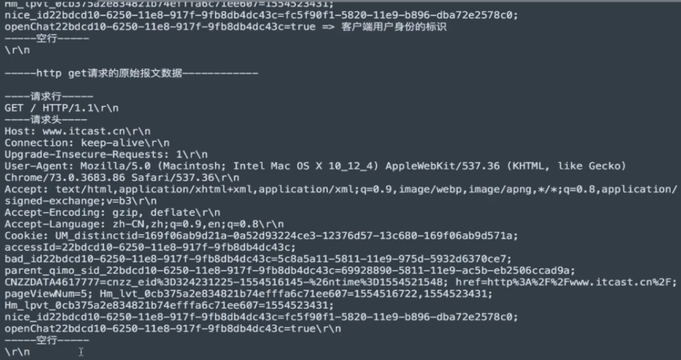

# URL

### 1.URL的概念

URL的英文全称是(Uniform Resoure Locator),表达的意思是统一资源定位符,通俗的理解就是网络资源地址,也就是网址

### 2.URL的组成

#### URL的样子:

https://news.163.com/18/1122/10/E178J204000189FH.html

#### URL的组成部分:

__1.协议部分: __https://(默认情况下443)、http://(默认情况下80)、ftp://

__2.域名部分: __news.163.com

__3.资源路径部分:__/18/1122/10/E178J204000189FH.html

#### 域名:

__域名就是IP地址的别名，它是用点进行分割使用英文字母和数字组成的名字，使用域名目的就是方便的记住某台主机IP地址。__

#### URL的扩展:

https://news.163.com/hello.html?page=1&count=10

- 查询的参数: ?page=1&count=10

__参数说明:__

- ? 后面的page表示第一个参数,后面的参数都用&进行连接

### 3.小结

- URL就是网路资源的地址,简称网址,通过URL能够找到网络中对应的资源数据
- URL组成部分
  1. 协议部分
  2. 域名部分
  3. 资源路径部分
  4. 查询参数部分[可选]

在抓包或者网页调试数据中,在请求头文件中的`GET / HTTP/1.1`是一个请求行,反之替换为POST请求就是post的请求行

GET / HTTP/1.1=> 请求方法(方式) 请求的资源路径 http协议的版本
Host: www.itcast.cn => 服务器的主机ip地址和端口号，提示如果看不到端口号默认80
Connection: keep-alive => 和服务端程序保存长连接,当客户端和服务端有一段时间没有通信,那么服务端程序会主动向客户端断开链接,释放链接资源
Upgrade-Insecure-Requests: 1 => 让客户端请求不安全请求,以后要使用https
Accept-Encoding: gzip,deflate => 告诉服务端程序可以接收的数据类型
Accept-Language: zh-CN,zh;q=0.9,en;q=0.8 => 告诉服务端程序支持的语言
Cookie:xxx 表示用户身份

==注意:==在GET请求的HTTP协议中,即使请求体中没有数据,依旧需要在请求体的地方填入\r\n 表示回车和换行,并且在请求体和请求体之间有一个空行

----------------http get 请求报文的格式---------------
请求行\r\n
请求头\r\n
空行(\r\n)

请求体

提示:每项信息之间都需要一个\r\n,是要http协议规定

--------------http post请求报文的格式-------------------
请求行\r\n
请求头\r\n
空行(\r\n)
请求体

提示:请求体是浏览器发送给服务器的数据

-----------http 响应报文解析--------------
------------响应行(状态行)-------------
HTTP/1.1 200 ok => http协议版本 状态码  状态描述
------响应头----------

Server: Tengine =>服务器的名称
Content-Type:  text/html; charset=UTF-8  =>服务器发送给浏览器的内容类型和编码格式
Transfer-Encoding: chunked => 服务器发送给客户端程序(浏览器)的数据不确定数据长度,数据发送结束的接收标识:0\r\n 
Content-Length:内容长度
__注意:__Transfer-Encoding和Content-Length两者只能出现一个
-------空行-------
\r\n
-------响应体  就是真正意义上给浏览器解析使用的数据-------

__GET 方式提交数据给服务器以地址栏的方式提交给服务器,也就是?page=1&count=10类似的查询的参数的部分,严谨的说是以查询参数的方式提交给web服务器__

__POST方式提交数据会放在请求体中__

