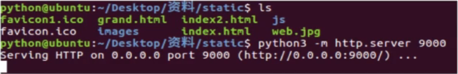

### 1.静态Web服务器是什么?

可以为发出请求的浏览器提供静态文档的程序。平时我们浏览百度新闻数据的时候，每天的新闻数据都会发生变化，那访问的这个页面就是动态的，而我们开发的是静态的，页面的数据不会发生变化。


### 2.如何搭建Python自带的静态Web服务器

搭建Python自带的静态Web服务器使用 Python3 -m http.server 端口号,效果图如下:



#### -m 选项说明:

-m表示__运行包里面的模块__,执行这个命令的时候,需要进入你自己指定静态文件的目录,然后通过浏览器就能访问对应的html文件,这样一个静态的服务器就搭建好了,默认端口号8000和django相同

`python3 -m http.server 9000`使用命令前需要指定资源目录和端口号,默认情况下,端口号为8000


### 3.开发静态Web服务器-返回固定页面的数据

#### 1.开发自己的静态Web服务器

__实现步骤:__

1. 编写一个TCP服务端程序
2. 获取浏览器发送的http请求报文数据
3. 读取固定页面数据,把页面数据组装成HTTP响应报文数据发送给浏览器
4. HTTP响应报文数据发送完成以后,关闭服务于客户端的套接字

#### 2.静态Web服务器-返回固定页面数据的示例代码

```python
import socket

if __name__ = '__main__':
    tcp_socket = socket.Socket()
```

