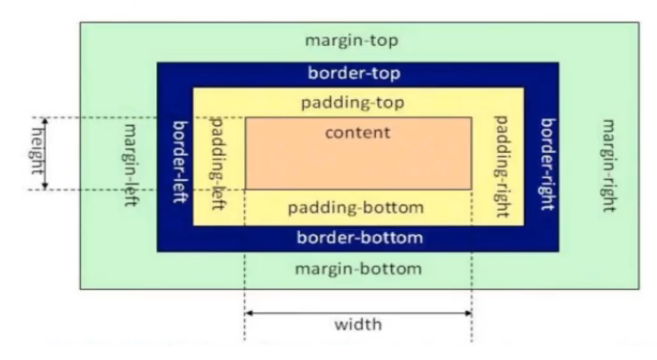

## 盒子模型

所谓的盒子模型就是把HTML页面的元素看作一个矩形盒子 矩形盒子是由内容(content)、内边距(padding)、边框(border)、外边距(margin)四部分组成·

#### 盒子模型的示意图如下:

默认情况下设置标签的大小实际上就是盒子模型的真实大小,但是设置边框值和内边距padding值都会影响盒子的大小

内容到边框的距离就是内边距padding值的大小

外边距(margin):是两个盒子边框之间的距离,也是从一个标签的边框到另一个标签的距离,叫做外边距

__注意:span标签和div标签都属于容器标签,但是div标签是块级元素,span好像是行内元素__