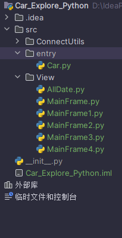

### 如何在python中实现跨文件夹的调用包中的方法

D:/IdeaProject/Car_Explore_Python/
└── src/
    ├── entry/
    │   └── Car.py
    └── View/
        └── AllDate.py

通过实验发现只是在程序的根文件夹中添加\__init__.py文件不能将文件根目录作为一个包,在这里不能像Java一般方便,但是可以使用sys模块将文件的根目录添加到总的python解释器的包中,之后使用类似于``from src.View import AllDate`方式导入文件夹中的这个包,但是在使用过程中最好不要使用相对路径处理类似../view

```python
import sys
sys.path.append('D:/IdeaProject/Car_Explore_Python/src')
from src.View import AllDate
print(AllDate.mapView)


import sys
print(sys.path)

```

