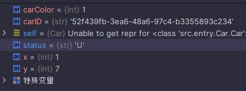

在python中静态方法使用@staticmethod关键字,其中如果staticmethod方法是写在class内部的,可以通过,类.方法名的方式调用,但是在使用的时候需要导入的模块必须要到这模块的类作为路径


给出一个测试用例,以及该测试用例对应的测试模块的方法
模块utils.py

```python
class MathUtils:
    @staticmethod
    def add_numbers(a, b):
        return a + b

```

测试调用模块test.py

```python
from utils import MathUtils
# import utils
# 调用静态方法
result = MathUtils.add_numbers(2, 3)

# result = utils.add_numbers(2,3)
print(result)  # 输出: 5
# 通过测试发现通过类.静态方法的方式能够调用讲台方法
```



在小车探索的项目中小车的其实坐标x,y=0,0实际上是位于左上角屏幕的
