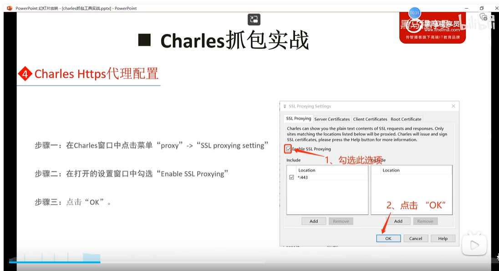

> 在DOS窗口中输入cls命令,<清屏>将屏幕中所有的多余的显示删除

> 使用nslookup命令查看对应url,本机的dns解析地址,或者是dns解析服务器
>
> nslookup www.baidu.com

> 使用win+R输入cmd可以进入到命令行模式
>
> 使用shift+ctrl+enter开启管理员模式的cmd命令行模式
>
> 使用win+x 可以查看任务栏等
>
> ctrl+shfit+esc打开任务管理器
>
> 在打开任务管理器 点击文件创建新任务	选择以管理员模式创建
>
> 在进入命令行模式中,默认显示的是当前文件夹中的内容
>
> 使用cd ..回退上一级目录
>
> 使用cd / 可以直接回退到当前盘符的根目录,如果想要切换到D盘需要输入D:进行切换,不需要输入cd
>
> 如切换到D盘的AiRui文件夹的Java文件夹下，只需要输入cd D:/AiRui/Java 即可
>
> systeminfo 查看计算机的相关信息
>
> pip install -i https://pypi.tuna.tsinghua.edu.cn/simple tensorflow==2.10
>
> 点击alt +F4快速关闭当前进程 ctrl +shfit+delet
>
> 可执行程序的运行(as指的是需要运行的程序名称)	./as 	/data/local/tmp/as
>
> 查看用户组和文件权限 ls -l
>
> 安卓的用户组包括System,root,shell,其中包括9个字符,下面是第一个字符的相关解释
>
> `- 表示普通文件`
>
> `d 表示文件夹`
>
> `l 表示符号连接(软连接->打印出指向的真实文件)`
>
> rwx 表示文件权限,r代表可读,w代表可写,x代表可执行	- 表示没有权限	也可以使用字母标识权限: r=4	w=2	x=1
> 第一个rwx代表文件所有者的权限,第二个rwx代表和所有同组人的权限,第三个rwx代表其他用户对该文件的权限
>
> 赋权执行	chomd 777
>
> 注意:在win中文件目录使用的斜杠是\,在linux中使用的文件目录是/ 
> 将程序安装到安卓	adb push d:\1.apk /data/app/1.apk
> 更改目录	chomd 777 app
>
> rm -f 强制删除	rm -rf	递归强制删除
>
> ps	打印进程信息
>
> ps  | grep init	过滤打印出和init相关的进程

- data分区的常见目录: app,system,data,local,misc
  - data/data目录
    - 存放所有apk的程序数据的目录,每个apk对应一个Data目录在data/data/目录下,会产生一个和Package一样的目录,比如一个apk,它的包名com.test.hello,则在data/data目录下会产生一个com.test.hello目录,并且该目录只能操作当前apk
  - data/app目录
    - 用户安装的apk在这里,将apkpush到此文件夹下则apk静默安装
  - data/misc目录
    - 保存的wifi账号等在其中可以查看到相关信息
    - 使用cat命令可以打开文件内容查看


- system分区常用目录:app,lib,xbin,bin,media,framework
  - system/app目录
    - 存放系统自带的apk,将apk放入System/app目录下,也是静默安装
  - system/lib 目录
    - 存放apk程序用到的库文件
  - system/bin 目录和system/xbin目录
    - 存放shell 命令	
  - system/framework目录
    - 启用安卓系统使用的框架,比如以下jar文件
- sd卡目录: /sdcard  /mnt/sdcard



如果你是直接通过命令行运行 jadx-gui，你可以在运行命令时指定 Java 虚拟机参数。使用 `-Xmx` 参数来设置最大内存大小。例如：

```
jadx-gui-1.3.4-no-jre-win.exe -Xmx8g
```


"C:\Program Files\Java\jdk1.8.0_311\bin\java.exe"  -jar ThinkphpGUI.jar

win + x 打开设备管理器等

使用`msconfig`在win+R的运行窗口中使用也能够打开资源管理器和调试开机页面的选项


在 Windows 系统中，可以使用 services.msc 命令来打开服务控制台，具体步骤如下：
按下 Win+R 组合键打开 "运行" 对话框。
在 "运行" 对话框中，输入 services.msc 并按下回车键。
这样就会打开服务控制台，你可以在这里查看、启动、停止、重启、控制系统服务。
另外，如果你想要在命令行中控制服务，你可以使用 net start，net stop 和 sc config 这样的命令。例如，以下命令将启动 "Print Spooler" 服务：

net start spooler
类似地，以下命令将停止 "Print Spooler" 服务：net stop spooler

使用`mstsc`在win+r后输入的显示框打开远程服务的连接窗口


> 使用win+w能够选择开启白板的输入可以接入手写板,或者是在窗口上截屏

在edge中使用快捷键ctrl+q实现搜索