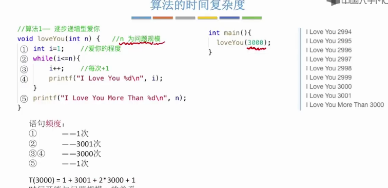
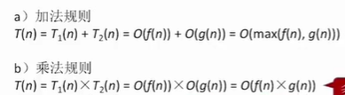
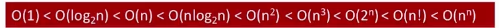
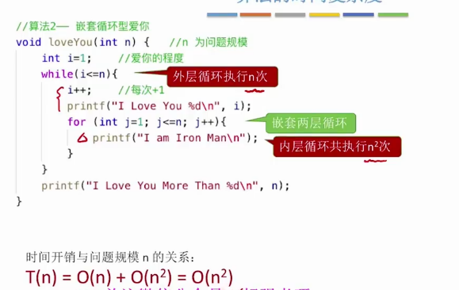
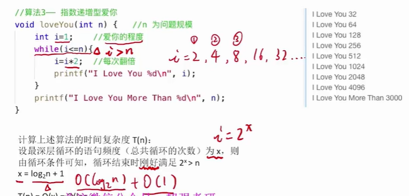
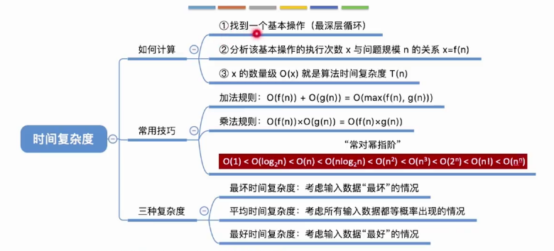
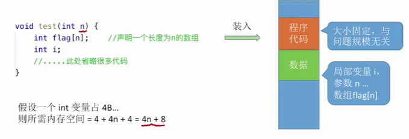
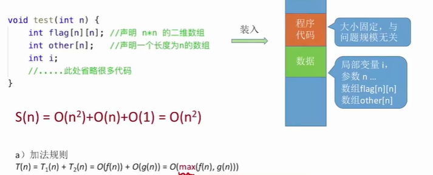
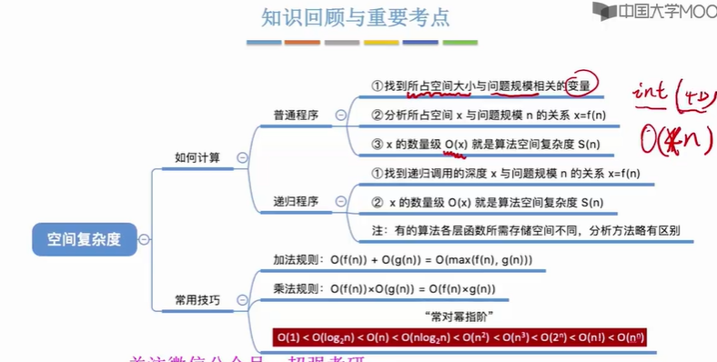

# 算法效率的度量

1. 时间复杂度
2. 空间复杂度

如果采用直接计算时间开销的(事后统计时间)方式计算算法的时间复杂度可能存在的问题:

1. 与机器的性能相关
2. 和编程语言相关,越高级的怨言的执行效率越低
3. 和编译程序产生的机器指令质量相关...

### 时间复杂度 ==:时间开销与问题规模n之间的关系==

事先预估的算法时间开销T(n)和问题规模n之间的关系(T 表示"time")

在这个C语言编写的代码中,while的判断条件执行了n+1次,由于发现条件不满足时,退出循环体,所以下面的5只是执行一次,   	需要注意的是在计算复杂度时:计算的度量单位是函数中的内容,不包括函数的调用以及函数的函数名等;

一个算法的时间表达式只需要关注时间阶数最高的部分,将常数部分省略;
用大O表示"同阶",同等的数量级.即:当n->∞,两者之比为常数

加法规则:
多项相加时,只保留阶数最高的部分,并将系数变为1

乘法规则:
多项相乘,全部保留

案例: T~3~(n) = n^3^ + n^2^ log~2~ n 的时间复杂度为:

时间复杂度的表示:O(n^3^)+O(n^2^ log~2~n)

常,对,幂,指,阶:

> 结论1:顺序执行的代码智慧影响常数项,可以忽略常数项的表示
>
> 结论2:只需要挑选循环中的一个基本操作分析他的执行次数和n之间的关系
>
> 结论3:如果有多层嵌套循环,只需要关注最深层的循环循环了几次 

> 知识回顾和重点
>
> 

### 空间复杂度==:空间开销(内存开销)和问题规模n之间的关系==

S(n) = O(1)
注:算法可以原地工作--算法所需要的内存空间为常量

其中4指的是传入的整型变量参数所占用的内存大小,4n指的是整型数组,还有一个是整型变量i占用四个字节

对于二维数组`int flag[n][n]`的空间复杂度为4*n^2^

> 在函数调用的时候也会增加内存的开销需要注意
>
> 当递归函数的调用时:当问题规模为n时,所需要的内存大小为kn个字节
>
> S(n) = O(n) 递归函数的空间复杂度等于递归调用的深度 

知识总结:

