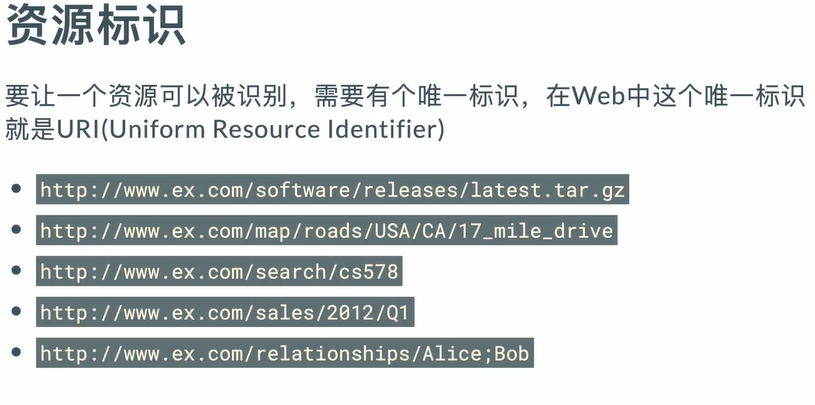
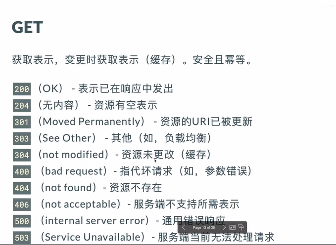

### REST风格

使用restful风格设计系统使得系统的设置更加标准化,避免了MVC结构中由于接口不统一产生的命名歧义;

使用REST风格的好处,如果没有明确要求显示层的样式必须对数据进行渲染,那么在使用的过程中,可以将model层传入的特定格式的数据直接返回到客户端并响应而不要求渲染,一般的返回的响应数据的格式为json格式,基于rest架构的服务不仅仅是对用户返回数据(可能是特定的类型),后端完全变为数据源(数据源貌似是在系统中为系统提供一些数据的计算并返回);

rest架构风格的主要提出者:Roy Thomas Fielding是http协议的主要设计者,apache服务器软件的作者之一,apache基金会的第一任主席

REST全称  representational state transfer表现层状态转换		资源表现层状态转换

REST指的是一组架构约束条件和原则:

- 为设计一个功能强,性能好,适宜通信的web应用
- 如果一个架构符合rest的约束和原则,称为restful架构

核心概念:

- 资源
  - 网络中的所有的实体,或者说网络上的一个具体信息,只要被引用到,就是一个资源(一个文本,图片,服务,手机号码...)
  - 在rest风格中,每一个资源必须有对应的资源标识,可以对资源标识虚拟化在路径中的资源只是一个映射,并非真正的资源地址
  - URL设计原则
    - 易读,表达资源的层级关系,表达资源的同级关系,表达资源的过滤
  - 资源的表现
    - 资源的表现是资源具体呈现出来的形式,叫做表现层;一般的资源可以采用原有的数据格式或者是HTML,XML,JSON,YAML,也可以是二进制数据
- 表现层
- 状态转化
- 下面的图片中是对于rest架构中的请求的约束

在请求关系中,GET和HEAD是安全的请求,无论请求次数,只是作为查询不会改变服务器中的数据的状态;

GET,HEAD,PUT和DELET请求是幂等的,无论操作的次数,在第一次的操作后,后面的操作不会在改变服务器中第一次修改后的数据的状态

在一般情况下,使用get请求是获得服务器中的数据的状态,而不是改变服务的状态,但是在post请求中,使用post一般是为了向服务器中增加资源的数目而不是获得某种信息;一般使用DELETE命名用作删除信息