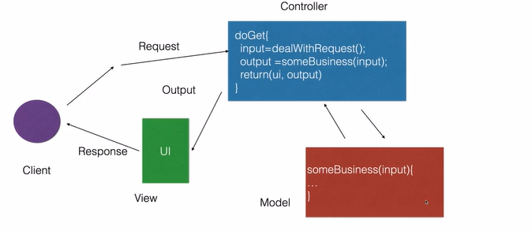

## 分层架构(典型的有MVC结构)

 发展--中间件软件

初始状态:硬件+操作系统+数据库管理系统+应用软件

程序的共性(稳定)成分:资源管理和服务

产生:中间件(应用服务器)		分离出:业务逻辑

常见协议IIOP协议,SOAP协议,JRMP协议,EJB本地协议

将不同应用中的公共共性部分提取出来,形成一层结构/协议,将大的复杂的项目分解称为若干个小的,分而治之,降低复杂问题的求解

常见的分层设计的系统: 例如 桌面软件,QT跨平台桌面程序

例如:分为展示层,业务逻辑层,数据访问层(每一层有对应的独立的职责)

典型MVC架构:M(model)指的是业务模型,V(view)指的是用户界面,C(controll)指的是控制器

在一个类似于JavaWeb的商城项目中,典型的显示层View代表的是Html前端页面,控制层Controller指的是Go语言写的后台相应控制,其中的Model模型层指的是业务模型例如数据库

 

展示层view:显示界面使得用户可以与环境交互

业务逻辑层:对显示层中提交的数据进行处理,计算或者校验

数据访问层:通过数据访问层对数据进行访问和处理存储等

业务逻辑如果在服务器中处理,则属于胖服务器瘦客户端的模式,如果业务逻辑在用户端处理,则属于瘦服务器胖客户端

> 案例:简单的pos机处理系统

可以使用==cs模式==处理(client/server)客户机服务器模式
一般情况下:C/S的传统形式适用于用户个人软件系统
对于多个有计算能力的pc机,并且与服务器相连接,使得pc机也能够用于运算,但是在使用过程中对于数据的存储等主要还是依赖于服务器
变为三层架构的好处:资源共享,集中化管理,性能分布,安全

==BS模式==:

 使用类似于Java中的Servlets或者是jsp的应用使得前端页面的出现,无需使用本地应用实现,可以使用标准web技术,如:浏览器等,使用标记语言HTML,XML,Xpath等;更加进一步的降低了系统部署的开销,但是缺点是页面的效率比较低,servlet技术的最大缺点比如不容易变化源代码;所以可以采用分层的mvc结构在sevlet页面中

在上面的MVC结构中,UI指的就是前端页面一般情况下是HTML标记语言组成,其中的控制器由servlet中的doGet/doPost方法控制,但是其中真正实现业务核心的是model层,其中包含了控制的算法,计算的算法/数据的校验,但是model层的方法由control层调用,所以分为三层的MVC结构,控制器,模型,视图;

典型的MVC结构中将系统分割为processing.output,input三个部分,"Model":processing,核心数据功能(将Controller中发送的计算请求处理,并将处理后的结果返回控制器);"View":output,从Model获取数据显示给用户(使用类似Html 的模板语言编写);"Controller":input,处理事件操作模型(将计算请求处理,将对应的计算请求传递给model模型中,接收到控制器中的数据,将控制器返回的数据在前端的View层显示)

典型的mvc架构:Graphical Editing Framework(GEF),Spring MVC(Spring MVC),ASP.Net MVC,Struts,Flask;

==多视图==

使用三层的MVC结构实现应用解耦,将视图与服务之间的处理不必写死,而是采用控制器处理的方式解决

在使用Spring MVC或者是Flask中的templates中存放着三层架构中的View层html标记语言;