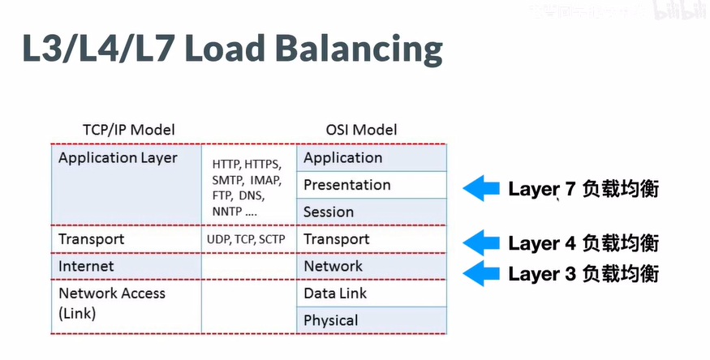

### 可拓展的web架构(基于CS/BS)

Server端:用来保存数据/执行业务逻辑;执行的数据或者是业务逻辑可以通过网络使得多个client共享,使得用户可以在不同的client中进行交互,用户产生的输入交给Server中进行处理;将处理完的结果在返回给client端,在client端的展示层就可以展示出结果;

多个用户可以通过一个网络连接到一个服务器中共享资源,共享数据,算力等;例如;B站可以使用C/S架构模式通过大量的服务器提供较高的算力和服务给client用户使用,但是随着client的增加对于服务器的要求越来越高,如果业务是一个计算密集型的业务类型,当用户多时服务器会挂;

垂直拓展:通过附加经济的方式,对硬件系统进行升级以达到更好的性能,解决问题的方法叫做拓展;

使用虚拟化技术可以实现垂直拓展的模拟:主要有两种方式,一种是使用虚拟机的在硬件逻辑上的虚拟化,一种是使用docker容器实现在进程级别的虚拟化,相比较而言,进程级别的虚拟化更加节省空间;

水平拓展:使用负载均衡的策略模式,通过负载均衡器将cs/bs架构中,不同的客户端Clients中的请求拓展到不同的server服务端中,对于用户来说在体验上还是使用的是一个服务端,但是由于负载均衡的水平拓展方式,使得对应不同请求的响应速度加快,使得各个用户client端的请求不会冲突,出现cpu忙等的现象;

负载均衡:

- 可以通过网络层的协议技术,DNS Round Robin(DNS轮询),通过多个服务器使用不同的DNS协议解析,能够将服务器之间的压力降低,优点:使用简单,不会有较多的操作;缺点:难以控制,由于DNS的刷新速度较慢,所以当其中的某个服务器宕机后,对于整个系统会产生较高的延迟操作由于刷新速度较慢
- L3/L4/L7 Load Balancing:负载均衡技术

在网络层第三层(如果是tcp/ip协议就是IP层),第四层传输层(在tcp/ip协议中就是tcp/ip层),第7层的协议中就是应用层实现,使用LoadBalancing协议中使用load balance(active load balancer 和 backup load balancer)避免了如上面的DNS中单点失效的问题,就是在服务器的集群中其中某一个服务器出现故障宕机;在load balancing技术中L4负载均衡使用ip+端口的方式能够定位到一个进程,socket套接字;

 使用Catch技术优化计算过程,将部分计算过的数据缓存于服务器,但是在使用负载均衡技术后,大量的catch缓存会出现Cache missing,在请求获得资源后保存在服务器,当客户端再次请求相同资源时,直接使用缓存后的数据,无需在向服务器发送请求等待计算,在很大程度上节省计算开销;在Java的spring中可以使用@Cacheable注解,直接作用于方法上,用于对于方法返回结果进行缓存;缓存后的响应速率几乎为0;

使用Cache Server服务将所有的缓存写在一个Cache Server中提高缓存的效率;可以使用Java中的SpringCaching,默认情况下使用的是EhCache技术缓存,使用Couchbase非关系型数据库缓存,或者使用Redis内存数据库缓存数据以达到在整个集成中保存数据

==注意==:`在spring中使用@Cacheable的0缓存技术似乎和redis中的缓存 `

可以使用redis作为数据源,作为catch的保存;使用redis作为服务端集群的缓存,保存多个Server缓存数据;但是当大量服务器均以redis作为缓存服务器时,该redis服务器作为单点服务器,作为瓶颈;所以使用redis cluster集群实现大量catch的管理

服务器端使用cookie/session保存服务器端和客户端的会话数据,可以使用session server的方式保存用户会话防止用户丢失;可以使用HAPROXY负载均衡的方式存储并处理session

也可以使用jdbc连接将session会话存储到sql数据库中;使用redis存储session会话,或者使用多个redis构成集群,使用散列算法,将会话数据存储到多个redis中,提高响应的速率;(只适用于大型项目需要高并发的)