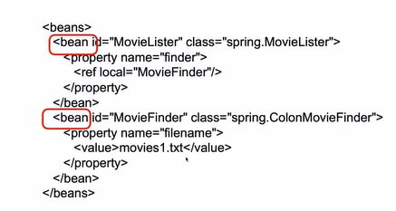

## Components-based

> 通过使用构建快速开发软件原型
> 软件的构件是用来组装的单元,具有协约化的接口设计

> CBSE基于构建的软件工程方法
>
> CBD基于构建的开发方法
> 都是一种可复用的方法,使用松耦合的独立构件,组装构造出复杂的软件系统
>
> 使用第三方组件,降低成本,通过更新组件对系统进行更新演化

Componnent interface:软件组件的接口

==Spring:==

> 基于构件的软件开发,由Spring构架控制程序中各个类之间的关系,而不是通过手工编码的方式操控代码
>
> 通过"注入"将一个软件构件与另一个软件构件相结合

```java
public interface MovieFinder{
List findAll();
}

public class MovieLister{
    private MovieFinder finder;//创建一个用户接口的对象
    public Movie[] movieDirectedBy(String arg){
        
    }
}
```

 在组件的调用过程中使用一些注入的方式例如使用组装器实现注入过程,在构造使用某种构件时使用他的构造器,或者是使用setter方法通过set来创建组件,再或者使用接口创建(比较少用)

Assembler组件容器

在spring中使用xml文件描述一些软件构件,其中类似bean或者是component都是Spring中管理的软件构件

关于上面的xml解释如下,存在一个组件MovieLister通过类型为spring.MovieLister创建,并且需要一个组件,组件名叫做finder,并且需要一个组件MovieFinder;	将下面的MovieFinder组件与上面的组件相绑定
