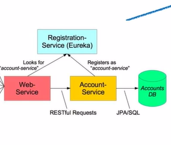

### 微服务架构

目的:将每个细化的服务进行独立拓展,可以对每个细化的服务进行负载均衡

martfowler实现微服务,应用中间包含多个功能,但是在逻辑上可能是独立的,在功能上可能可以进行拓展, 将单例应用做成微服务化的应用

将每个服务划分为详细的功能,并将每个功能,使用独立的微服务运行,使用Eureka注册服务进行注册,以便于不同组件之间通过Eureka连接通信

RegistrationService(Eureka)注册服务,Eureka类似于DNS服务查找服务.

restTemplate相当于通信代理中的HTTPClient, 能够发出请求

Client-side load-balancing:在没有使用负载均衡器的情况下,同一个server多个实例注册在同一个注册处(Eureka)使用服务的调用中使用restTemplate从注册处寻找实例,并且restTemplate可以实现负载均衡

将单体应用拆解为独立的服务,可以对每个服务使用不同的技术栈开发,对每个服务的模块使用不同的语言,不同的技术实现不同的功能,在每个功能之间使用HTTP协议或者是其他的,在人员上由于将工作分解,对于人员的数量可以减少,按照不同功能的工作量决策人员的数量,可以细化人员的分配,人员的调度和部署也会较为简单;对于微服务中的分布式可以使用Eureka对服务注册,使用Zipkin记录分布式过程中的trace类似于日志;

断路器:由于将单个单体应用分解为多个微服务结构,所以在完成某一个功能时可能调用的是一个调用链,但是在调用链中如果某一个服务出现问题,会导致间接或者直接调用的引发异常,所以产生断路器来处理问题,实现保护机制,也可以使得原来异常的服务在断路器的保护下,拦截上层调用发来的请求,防止再次对正在回复的异常处,再次引发问题.

SpringBoot:对于Spring的拓展,可以快速独立拓展出,产品级别的应用;

starter 是在使用spring中的依赖的描述,是使用中的所有的依赖的集合

