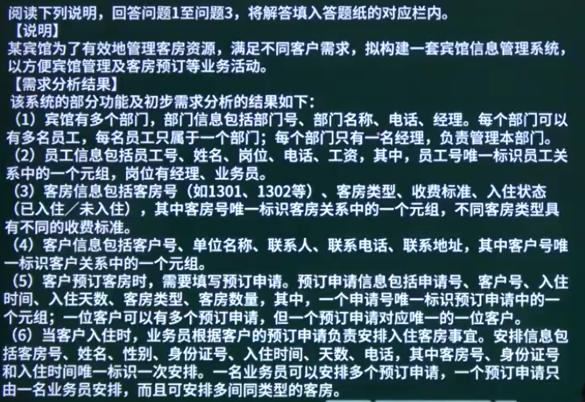
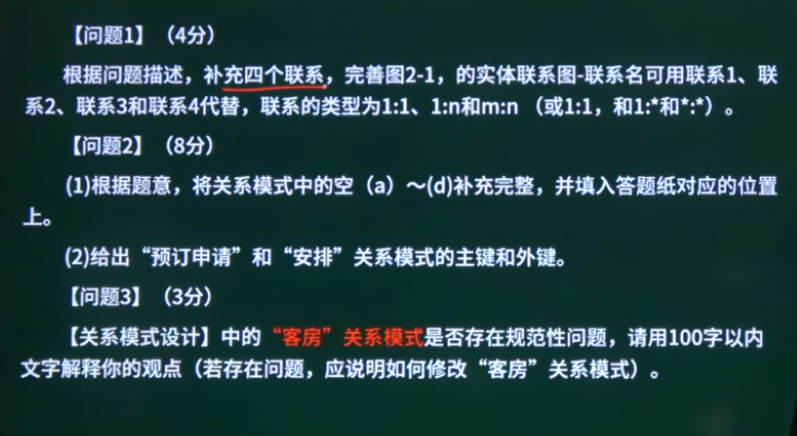
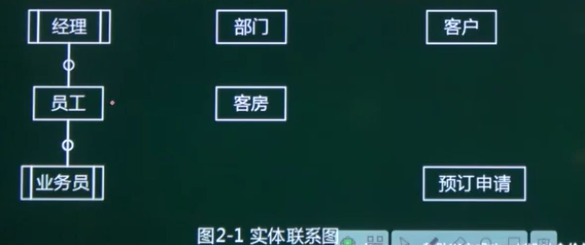

> 读取第一条题干可以得到:
>
> 员工与部门之间的关系是m:1/n:1 的关系	每个部门可以有多个员工,但是每个员工只能属于一个部门	菱形中的联系名称可以叫做:管理
>
> 经理和部门之间的关系是1:1 的关系,每个部门只有一个经理		菱形中的联系的名称可以取为:隶属...	
>
> 一个客户可以有多个预定申请,但是一个预定申请对应唯一的一位客户	客户和预定申请的关系是1:n/1:m 	菱形中的联系名称可以叫做联系xx

关系模式设计
部门(部门号,部门名称,经理,电话)
员工(员工号,部门号,姓名,岗位,电话,工资) -->可能存在联系的归并,将员工的某些属性隐藏在题干中
客户(客户号,单位名称,联系人,联系电话,联系地址)其中客户号作为主键
客房(客房号,客房类型,收费标准,入住状态)
预定申请(申请号,客户号,入住时间,入住天数,客房类型,客房数量)
安排(申请号,客房号,姓名,性别,身份证号,入住时间,天数,电话)